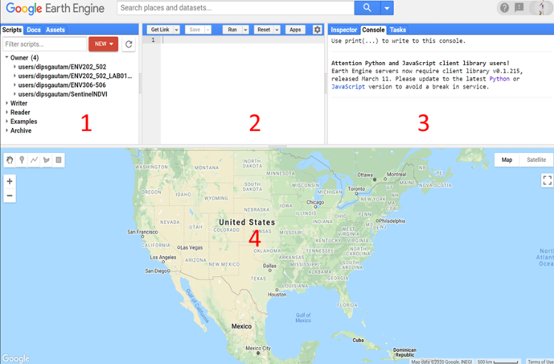
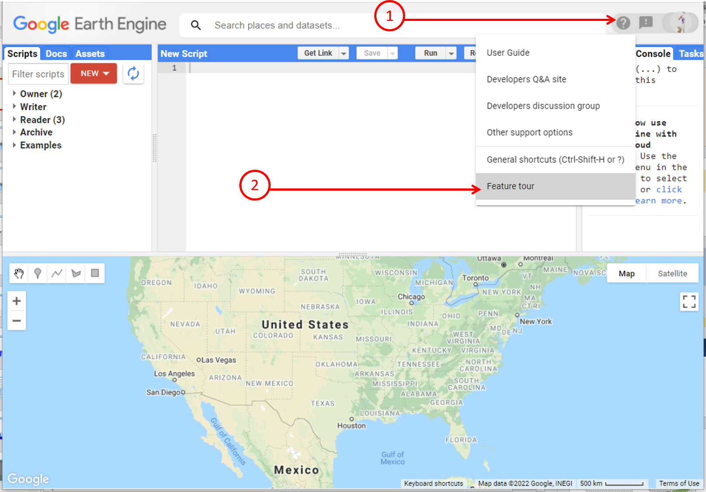
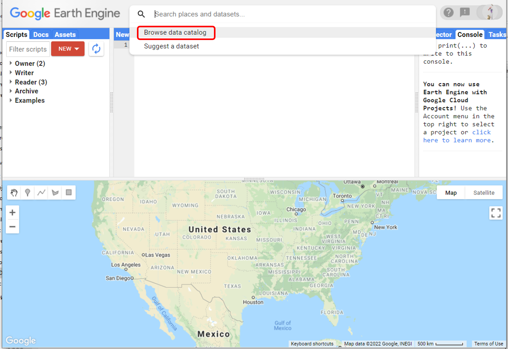
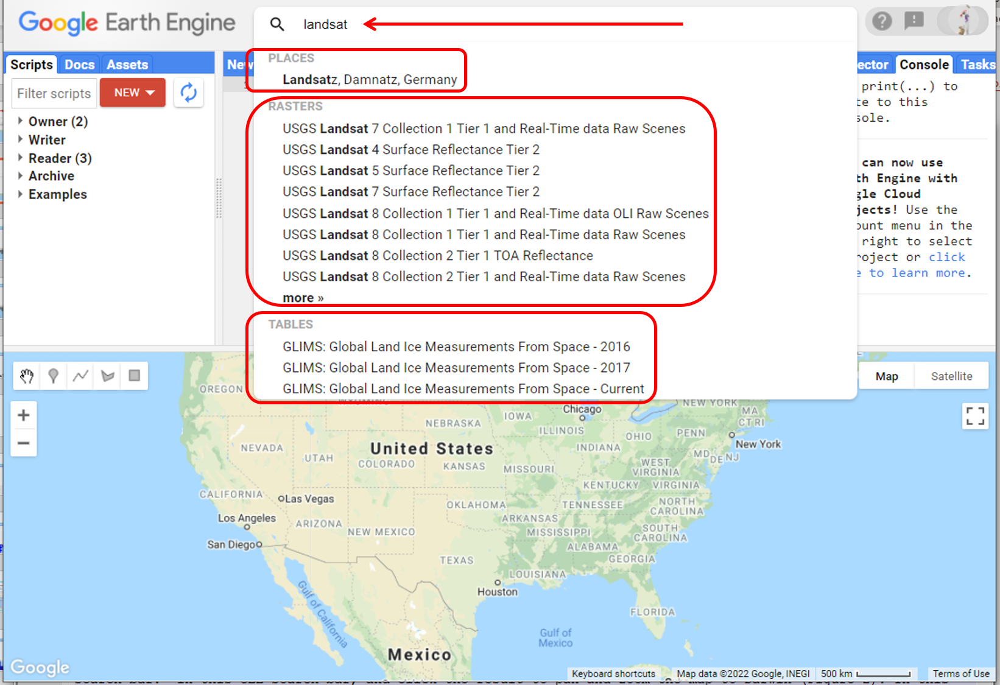
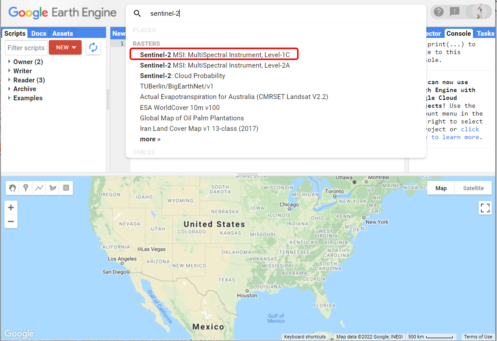
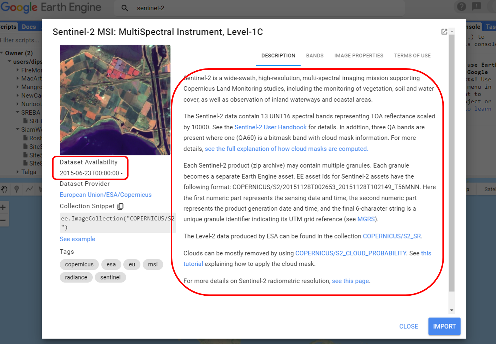
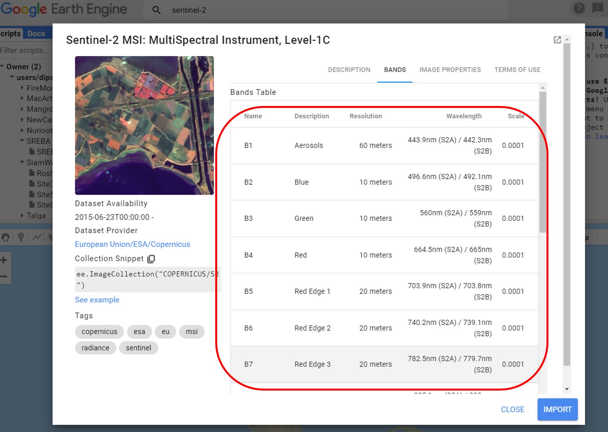

# Introductory Remote Sensing (ENV202/502)
Prac 1 - Introduction to Google Earth Engine (GEE) and basic JavaScript


### Acknowledgments 
- [Earth Engine Beginning Curriculum](https://docs.google.com/document/d/1ZxRKMie8dfTvBmUNOO0TFMkd7ELGWf3WjX0JvESZdOE/edit#!)
- [Google Earth Engine guide](https://developers.google.com/earth-engine/guides)


### Prerequisites
Completion of this Prac exercise requires the use of the Google Chrome browser and a Google Earth Engine account. If you have not yet signed up - please do so now in a new tab: [Earth Engine account registration](https://signup.earthengine.google.com/)

Once registered you can access the Earth Engine environment [here:](https://code.earthengine.google.com)

Google Earth Engine uses the JavaScript programming language. We will cover the very basics of this language during this course. If you would like more detail you can read through the introduction provided here: [JavaScript background](https://developers.google.com/earth-engine/tutorials/tutorial_js_01)

### Objective
The objective of this Prac is to give you an introduction to the Google Earth Engine processing environment and basic JavaScript. By the end of this exercise, you will be able to navigate the Google Earth Engine environment, search for and find a broad range of remotely sensed datasets.

---------------------------------------------------
## 1. Signup for the GEE environment
1. If you have not done so already, sign up [here](https://code.earthengine.google.com/signup/)
2. Follow the signup and activation process.
3. For help look into the "Frequently asked questions" file in your learnline.

## 2. Navigate through the GEE environment interface.
1. Open up the Google Earth Engine environment by going to this address in the **Chrome browser**: [https://code.earthengine.google.com](https://code.earthengine.google.com). You should see the GEE landing page as below. This suggests that your signup and activation of the Earth Engine account went through well. 



2. Notice GEE environment is divided up into four panels: 
- The top-left panel has tabs for Scripts, Documentation and Assets 
	- Scripts tab for managing your programming scripts.
	- Docs tab for accessing documentation of Earth Engine objects and methods, as well as a few specific to the Code Editor application
	- Assets tab for managing assets that you upload. 
- The editor (top-centre) panel is for writing and running JavaScript commands  
- The top-right panel has tabs for the console, inspector and tasks  
	- Console tab for printing output.
	- Inspector tab for querying map results.
	- Tasks tab for managing long­ running tasks.
- The bottom panel is a Map interface with geometry features and a google map like feel. 
- Search bar on the top to look for datasets and places of interest

3. I recommend you take the feature tour to learn more.

   

4. In this unit, you will frequently use following buttons and tabs: "Run", "Save", "Search", "Inspector", "Console", "Tasks", "Scripts", "Docs", and "Assets". Think about and do a google search on what the functionality of the above buttons and tabs are. 

**Question:** *What do you think will the "Run" button do?*

## 3. A basic introduction to JavaScript

1. Time to write your first JavaScript for Earth Engine! In the editor panel, paste the below script and hit run. "Hello World!" will be printed on the console tab. 
 
```JavaScript
print("Hello World!");
```

2. The line above is a JavaScript statement. JavaScript statements end in a semicolon. Earth Engine programs are made up of a set of statements like this one. You can think of these statements as a set of tasks you want the earth engine to perform. Using the "print" command, you can print any text you want. Note that JavaScript and any other programming are quite restrictive in their syntax. The barebone structure "print(" ")" cannot be changed. Any text that is placed within the quotation gets printed.

**Question:** *Modify the above script to print your name in the console.*

3. When writing a rather long JavaScript program, it is a good practice to put lots of comments in your code- the comments are not executed but describe what you're trying to do. To comment, use "//" before the comment. for example: 

```JavaScript
// Printing hello world to the console
print("Hello World!");
```

4. In the above script, the content after "//" is ignored by the Earth Engine. These comments are for us to understand what's happening in the script. 

5. Using variables to store objects helps code readability. For example, a variable that stores a string (text) object is defined by single ' or double " quotes but don't mix them. In the below script, first, we make a new text and store it in a variable called toPrint. Second, we print the variable toPrint which is 'Ahoy there!'. So, if you run the script, it will print 'Ahoy there!'

```JavaScript
// Use single (or double) quotes to make a text.
var toPrint = 'Ahoy there!';
// Use parentheses to pass arguments to the command.
print(toPrint);
```

6. You may have noticed that we used a keyword "var" at the beginning of the script. "var" is always used when defining a variable. The name "toPrint" that we gave to the variable can be anything we want - but be consistent throughout a JavaScript program. Try changing the name of the variable and run the script. Try modifying the script to print something else. 

7. Variables can also store numbers. We define the number variables using the same way as string variables -  we just don't need to put the numbers in quotes. 

```JavaScript
// Store a number in a variable.
var height = 165;
print('My height is:', height);
```
8. Notice how within the print command, the text variable was placed in quotation while the numerical variable is not in the quotation. 

9. Try modifying the variable name "height" as well as the variable value to print your height.

**Question:** *Write a script that prints a person’s age. Use two variables to store the person name and age.* 

10. The best way to learn Scripting is to modify the script and make many mistakes - many many mistakes. If you are new to scripting and JavaScript, try to change and run the script and see what happens.

## 4. Finding images and datasets

1. There are basically two ways of finding images in GEE. One by exploring the data catalogue and second by just searching for the particular image that you want.

2. Let's first look at the data catalogue. To get to the data catalogue, you can go to this [link](https://developers.google.com/earth-engine/datasets/) or in your GEE, click on the search area and then click on the "Browse data catelog" button.


3. This will take you to the data catalogue webpage where you can click on "view all datasets" to browse all the datasets. You will find there are plenty of datasets and probably this is not the most efficient way of looking for a dataset. 

4. Now go back to the GEE and we will look for the dataset using the search button. Can you remember the name of some of the satellites that you heard in your lecture today? Does "Landsat" ring a bell? Type in "Landsat" in the search bar. You can hit enter on your keyboard to view all the datasets associated with "Landsat" while the most popular ones will be displayed to you without hitting the enter. Look at the different results and the categories of results you have.


 
 5. Three categories of results include "Places", "Rasters", and "Tables". Places display the addresses with the name. In the above example, Landsat is also a name of a place in Germany. Rasters list the satellite imageries with that name. In the above example, we have several Landsat. Finally, the Tables displays other types of geographic datasets - these are called vector datasets. We will learn about them in future classes. But for now, just know that there are different categories of results. If you are after images, you need to select the results under the "Rasters" category.  
 
 6. Try to remember other satellites that were mentioned in the lecture. Try to search for them - can you find them in the GEE? 
 
**Question:** *Name three satellites that you think are most useful in the context of environmental remote sensing.* 

## 5. Finding information about a specific satellite

1. Now that we know how to search for a dataset, let's learn how to gather basic information about a particular dataset that we are interested in. The skill to look for basic information will be important for you in the upcoming Pracs and assignments when you need to modify the scripts. 

2. Type Sentinel-2 in your search bar and click on the Raster result called "Sentinel-2 MSI: MultiSpectral Instrument, Level-1C".


3. This will open up an information tab for the Sentinel-2 satellite. In the information tab, you can read about the satellite. Such as what is this satellite about and what is the data availability. In the below example, the Sentinel-2 data is available since the 23rd of June 2015. 


4. Now click on the "Bands" tab. This tab has all the information about the bands that Sentinel-2 images have. The name of the band is how the GEE understands which band we want to do certain computations on. For example, if we want our computation on the Blue band, we need to call it "B2" and so on. Note the number of spectral bands (from B1 to B12) and the spatial resolution of each band. The Sentinel-2 has 13 spectral bands with a spatial resolution of 10-60 metres. Additionally, the table also contains information on the wavelength of each band and the scale. The scale represents how the reflectance values are stored in the image. In the above example, the scale is 0.0001, this means reflectance values (normally stored in the range of 0-1) are stored in the range 0-10000. 



5. Now you can hit close. You know how to look for and find satellite data and information associated with the data. 

**Question:** *Using the above technique, try finding the data availability, band name, spatial resolution, and wavelength of Landsat-8 images. Write the information in some word/excel document you may find this useful for you Assignment#1*

6. Note not all satellite data is available in the GEE and not all the information may be written in the GEE information window. So, for further information, you will need to google search. 

7. You can close the window - you don't need to save this weeks script.
-------
### Summary
Today is the first day of your journey in learning GEE for remote sensing. Today we covered the very basics of the GEE interface, learnt basic JavaScript, and learned how to search for and find a broad range of remotely sensed datasets. Next week we will look into a visualisation of the satellite images. 

I hope you found this prac useful. A recorded video of this prac can be found on your learnline.
### Thank you
#### Kind regards, Deepak Gautam
------
### The end
