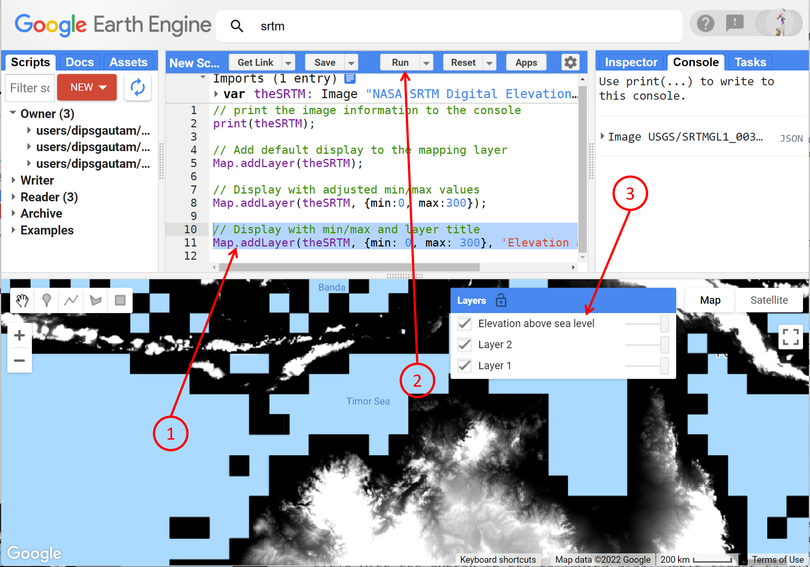

# Introductory Remote Sensing (ENV202/502)
Prac 2 - Image visualisation (single- and multi-band)


### Acknowledgments 
- [Earth Engine Beginning Curriculum](https://docs.google.com/document/d/1ZxRKMie8dfTvBmUNOO0TFMkd7ELGWf3WjX0JvESZdOE/edit#!)
- [Google Earth Engine guide](https://developers.google.com/earth-engine/guides)

### Objective

The objective of this Prac is to get you started with satellite images. By the end of this exercise, you will learn the visualisation skills of the satellite images. We will work on visualisation of single-band image (using NASA SRTM as an example) and multi-band image (using Sentinel-2 as an example). Using these skills, you will be able to visualise any other optical images in the Google Earth Engine.

---------------------------------------------------
## 1. Getting started with the image

1. Open up the Google Earth Engine environment by going to this address in the **Chrome browser**: [https://code.earthengine.google.com](https://code.earthengine.google.com).

2. Let's navigate to the Darwin area where we will be working today. Use your mouse left click and drag on the mapping area to pan to Darwin. You can use the mouse wheel or + - button to zoom in or out. The navigation in the mapping pane is very much like google maps.


3. Now let's search for an elevation dataset. In the search bar, type in "elevation" or "SRTM" and click on the "NASA SRTM Digital Elevation 30m" result to show the dataset description. To learn more about this dataset, check out the blurb and associated resources in the learnline.


4. View the information on the dataset - read under "description" and "bands". Once you are happy, click on "Import", which imports the image to the Imports section at the top of your script.


**Question:** *How many bands did this data have and what are their spatial resolution?*

5. Rename the default variable name "image" to anything you like. The naming convention is that the name should be short but descriptive enough for you to understand when you revisit this script later in the future. Here we will rename the image "theSRTM". This means we agreed with the GEE environment that "theSRTM" refers to the SRTM elevation dataset.


6. We used the print command in the last prac. Here let's use the print command to print the image object to the console by copying the script below into the code editor, and clicking "run" :

```JavaScript
// print the image information to the console
print(theSRTM);
```


7. The print command just prints the textual information, not the image. Browse through the information that was printed to the console window. Open the “bands” section to show the band named “elevation”. Note that all this same information is automatically available for all variables in the Imports section.


8. Always know that you can look into the image description or printed information, or within the import section to look into more detail about the image. 

**Question**: *From the image information that is printed to you, and the description window that was available to you, can you tell: how many bands does this image have, when this image was acquired, what is the spatial resolution of all the bands, what are the name of all the bands?*

## 2. Visualising the single-band image

1. Note that we are currently working with the single band image. Use the Map.addLayer() method to add/display the image to the interactive map. We will start simple, without using any of the optional parameters. After adding the script, hit "run" again. Every time you make changes to your script, you will need to run the script again to apply the changes.

```JavaScript
// Add default display to the mapping layer
Map.addLayer(theSRTM);
```

2. The displayed map will look pretty flat grey because the default visualization parameters map the full 16­bit range of the data onto the black-white range, but the elevation range is much smaller than that in any particular location. We’ll fix it in a moment.


3. To get a feeling for the range of elevation (min and max) for proper display, we can query the map to see what elevation looks like on a selected pixel. Select the Inspector tab. Then click on several points on the map to get a feel for the elevation range in this area.


4. Now you can set some more appropriate visualization parameters by adjusting the code as follows (units of the min and max values are in meters above sea level):

```JavaScript
// Display with adjusted min/max values
Map.addLayer(theSRTM, {min:0, max:300});

```


5. You will now be able to see the variation in the elevation range with low values in black and the highest points in white. Layers added to the map will have default names like "Layer 1", "Layer 2", etc. To improve the readability, we can give each layer a human­-readable name, by adding a title with the syntax in the following code. Don't forget to click run.

```JavaScript
// Display with min/max and layer title
Map.addLayer(theSRTM, {min: 0, max: 300}, 'Elevation above sea level');
```


6. Now you can also add the colour palette to make the elevation map look colourful and beautiful. Experiment with different colour combinations by changing/setting the palettes as per the example below. In the below example, lower elevations closer to the min value (0 m) are assigned to blue colour, higher elevations closer to max value (300 m) are assigned to red colour, and the medium elevation closer to 150 m elevation are assigned to yellow colour.

```Javascript
// Display with min/max, layer title, and color scale
Map.addLayer(theSRTM, {min: 0, max: 300, palette: ['blue', 'yellow', 'red']}, 'Color scale elevation above sea level');
```


7. That's how you display the single band image. The above line of the script is all you need. Note that JavaScript is sensitive to syntax, any error in syntax means the script won't run. For example, if you forgot to type a single ' or , or : or ) or ( in the above script, the script won't run. What you can play with and change in the above script are: theSRTM, 0, 300, blue, yellow, red, and Color scale elevation above sea level. 

8. Navigate to Kakadu national park where we have beautiful elevation changes. Try adjusting the min/max for better visualisation. Again, navigate to the Tibetan Pleatue and Himalayas, where you will see high topography over 3000 m. Try adjusting the min/max for better visualisation. Also, navigate to your home location and check out the elevation in the landscapes there.  

## 3. Visualising the multi-band image
1. For the visualisation of multi-band images, we will use a multi-spectral image collected by the European Space Agency's Sentinel-2 satellite. Sentinel-2 is a wide-swath, high-resolution, multi-spectral imaging mission supporting Copernicus Land Monitoring studies, including the monitoring of vegetation, soil and water cover, as well as observation of inland waterways and coastal areas. We will use an image collected over Kakadu National Park, Australia.

2. Let's navigate to the area of interest (Kakadu) by copying the code below into the Code Editor and clicking "Run". Remember that the line starting with // is a note to ourselves and others, and is not processed (we call this a comment). The numbers in brackets are the longitude, latitude, and zoom level (range is from 1 to 22). This is another way of navigation - previously we navigated by using our mouse. You can tick on/off the existing elevation layers as you need.

```JavaScript
//Navigate to the area of interest
Map.setCenter(132.5685, -12.6312, 8);
```


3. Now that we are in the right place, let's choose a Sentinel-2 image using the code below. Copy and paste into the Code Editor. Copernicus refers to the satellite mission, S2 is short for Sentinel-2, and the long number 20180422T012719_20180422T012714_T52LHM refers to a specific image, defined by date, time and a path and row of the satellite's orbit. Note that I have chosen a single image for this Prac, but we will cover searching for images for specific areas and dates at a later stage. 

```JavaScript
// Select a specific Sentinel-2 image from the archive
var anImage = ee.Image("COPERNICUS/S2/20180422T012719_20180422T012714_T52LHM");
```

4. Running the above script does not do anything visibly new. It simply has imported the Sentinel-2 image into our script. We have done a printing of image information for the SRTM image. Now, I want you to print the image information for the above Sentinel-2 image. (Hint - the SRTM image was referred to as "theSRTM", the Sentinel-2 image is referred to as "anImage"). 

**Question: ***How many bands do the above Sentinel-2 Image have, what are they and what are their spatial resolution and spectral position?*

**Question: ***How are the Red, Green, and Blue bands called in the above Sentinel-2 image (Hint: also look at Prac01)?*

5. Now before we go any further, please save your current script by clicking on the "Save" button. Save it into your course repository so that you can come back to it at any stage, and from any device with a Chrome Browser (Yes, you can even run the script from your mobile phone - how cool is that!!).


6. Getting back to our multi-band image, Bands 2, 3 and 4 are the blue, green and red bands respectively. Therefore if we wish to view a true-colour rendering of the image - i.e. an RGB composite, we need to place Band 4 into the red channel, Band 3 into the green channel, and Band 2 into the blue channel. We can do this with the code below - take careful note of the syntax for specifying the band arrangement.

```JavaScript
// Add RGB composite to map
Map.addLayer(anImage,{bands:['B4','B3','B2'], min:0, max:3000}, "True-colour");
```


7. **Take a moment** to play with and understand the above Map.addLayer script. This is super important. Also compare with the Map.addLayer script we used for single band image. Note the differences in the syntax for the single- and multi-band image: in the single band image, we don't need to define "bands" which we need to do for multi-band image (otherwise GEE won't know which band to display for us). The colour in the single band image comes from how we define "palettes" whereas the colour in multi-band image comes from the order in which the 3 bands are fed in (i.e. Red first, Green second, and Blue last results in RGB display). 


8. The min/max of 0-3000 is about right for the Sentinel-2 - this results in a view similar to what we would see looking out of the window of an aeroplane. You can play with the min/max value to see the change in contrast. The band combination ['B4','B3','B2'] displays the RGB composite. In the coming prac, we will work with other band combinations to reveal various patterns in our landscape that may not be visible to human eyes. Zoom in a bit closer using the wheel of your mouse. These images are a fantastic resource for environmental mapping and monitoring. The visible spectrum bands are at 10 m spatial resolution, and the revisit time of the satellite constellation is every 6 days in this region. Thanks, ESA!


9. Interpret the image taking into consideration when the image was captured. In the wet season, Northern Australia is vibrant with photosynthetically active vegetations, the surge in flood plains and water bodies. While in the dry season, the vegetation dries up,  bush fire takes hold, and water bodies retreat. 

10. Don't forget to save your script. You can use CTRL+S in the windows computer (Command+S in Mac) to save your script. 

## 4. Exercise for you
1. Using the scripts/knowledge we learnt today, try displaying the landsat-8 true color image from Darwin region. Use this image name "LANDSAT/LC08/C01/T1_TOA/LC08_106069_20210511". 

## 5. The complete script used in this Prac
```JavaScript
// print the image information to the console
print(theSRTM);

// Add default display to the mapping layer
Map.addLayer(theSRTM);

// Display with adjusted min/max values
Map.addLayer(theSRTM, {min:0, max:300});

// Display with min/max and layer title
Map.addLayer(theSRTM, {min: 0, max: 300}, 'Elevation above sea level');

// Display with min/max, layer title, and color scale
Map.addLayer(theSRTM, {min: 0, max: 300, palette: ['blue', 'yellow', 'red']}, 'Color scale elevation above sea level');


//Navigate to the area of interest
Map.setCenter(132.5685, -12.6312, 8);

// Select a specific Sentinel-2 image from the archive
var anImage = ee.Image("COPERNICUS/S2/20180422T012719_20180422T012714_T52LHM");


// Add RGB composite to map
Map.addLayer(anImage,{bands:['B4','B3','B2'], min:0, max:3000}, "True-colour");
```
-------
### Thank you

I hope you found this prac useful. A recorded video of this prac can be found on your learnline.
Coming up next week: Next week visualisation and computation

#### Kind regards, Deepak Gautam
------
### The end
