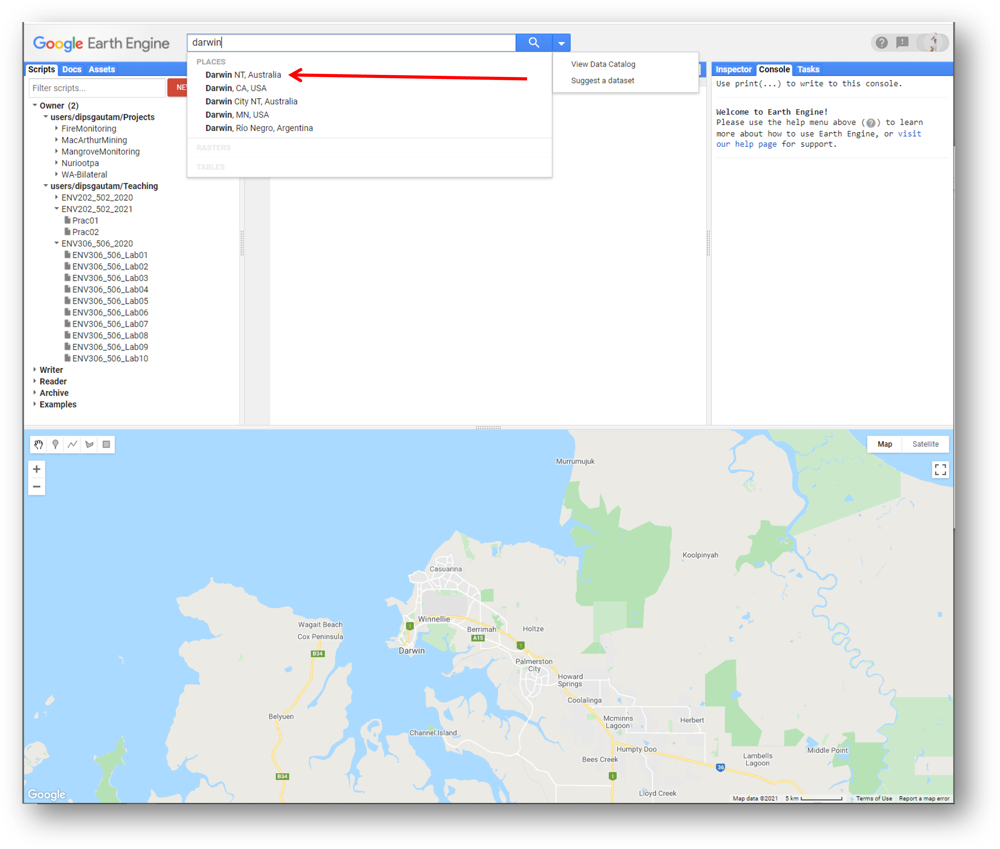
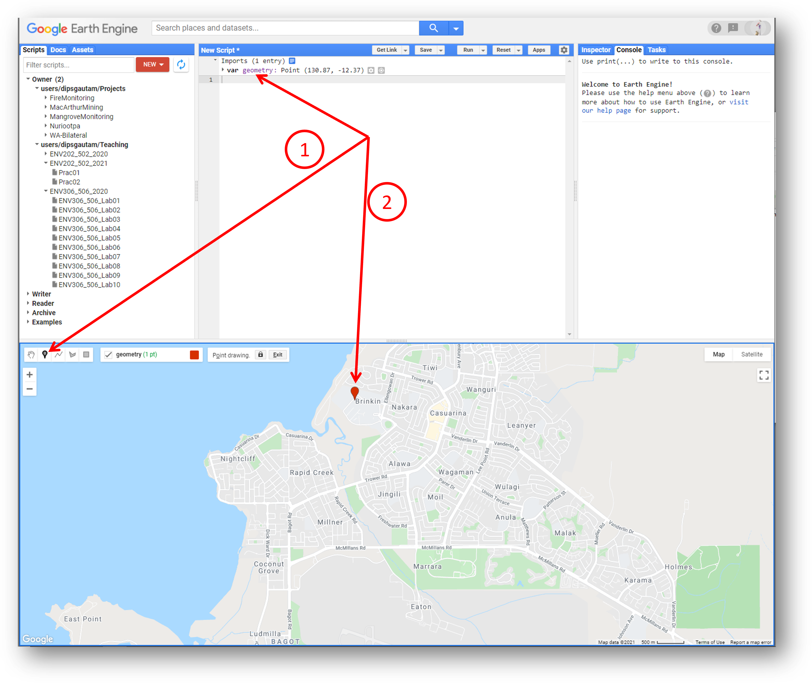
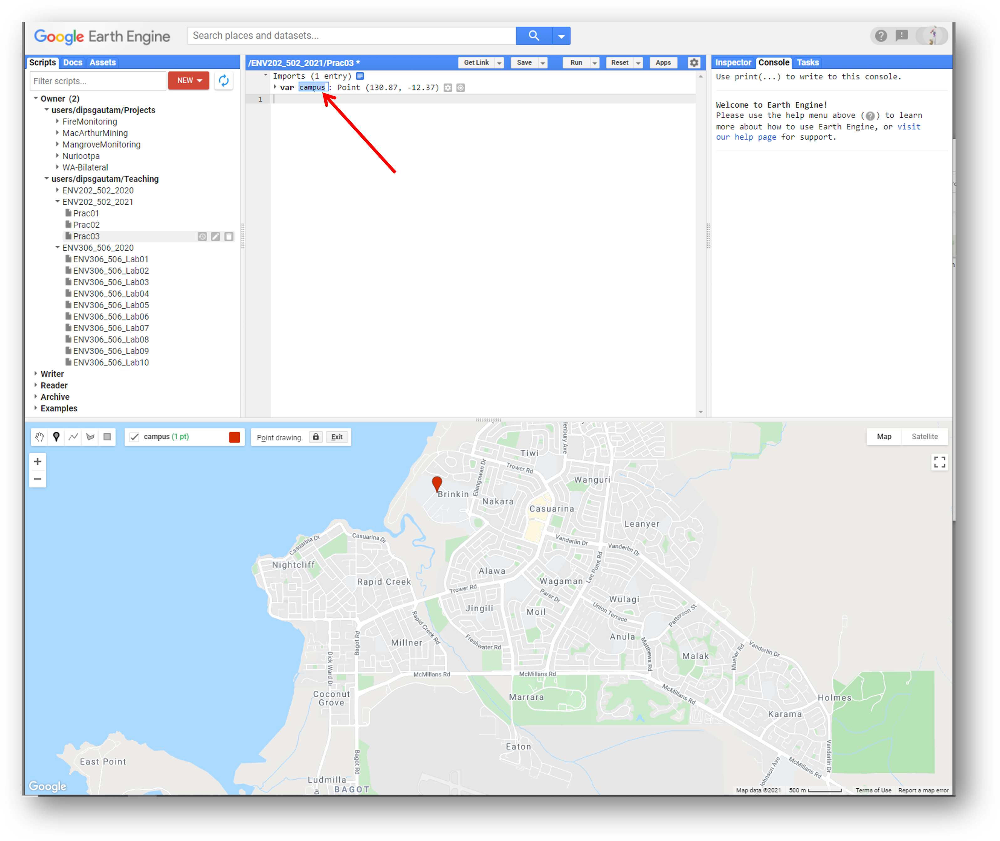
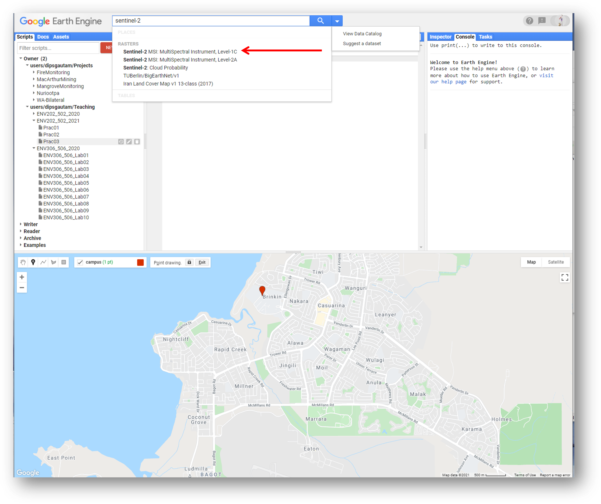
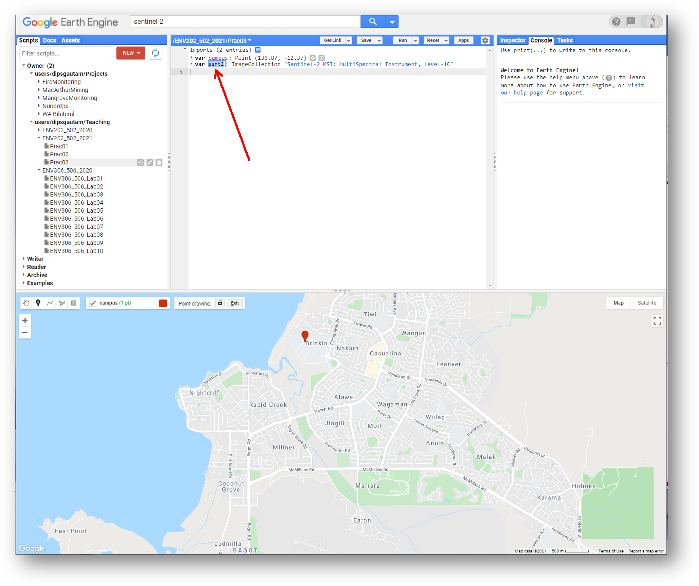
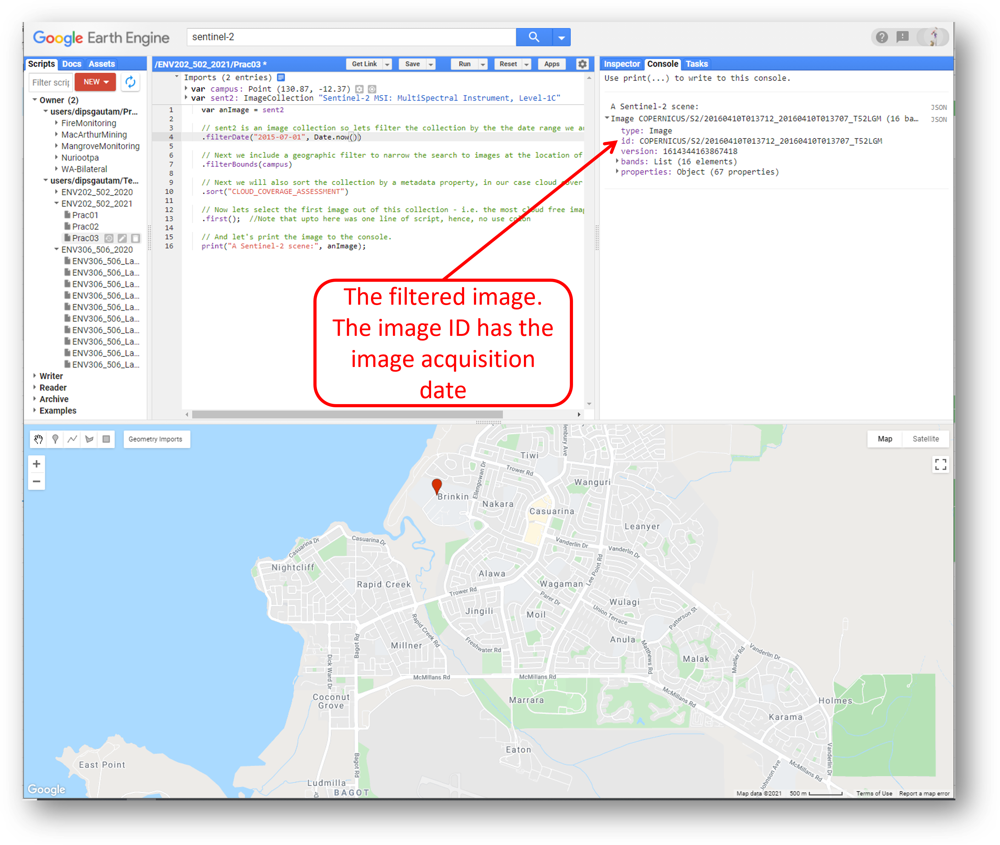
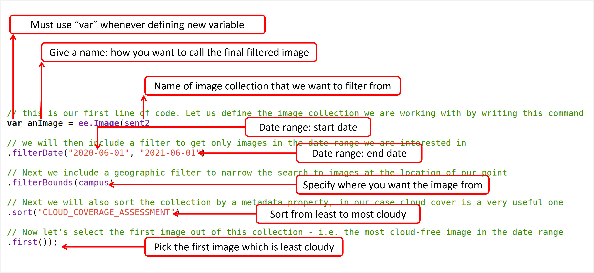

# Introductory Remote Sensing (ENV202/502)
Prac 3 - Working through image collection to find right image and computatin of indices

### Acknowledgments
- [Earth Engine Beginning Curriculum](https://docs.google.com/document/d/1ZxRKMie8dfTvBmUNOO0TFMkd7ELGWf3WjX0JvESZdOE/edit#!)
- [Google Earth Engine guide](https://developers.google.com/earth-engine/guides)

### Objective

So far you have worked with a single- and multi-band optical images. However, we have not worked with the image collection. Earth observation satellites in fact acquires image from small portion of earth surface. Through time more acquisition leads to global coverage and that is repeated over an over to create a historical archive of spatiotemporal archive. As a remote sensing scientist, you need to have the skills to look for and work with images acquired at a certain time and on a certain location - which is quite easy in Google Earth Engine. The objective of this Prac is to gain experience of working through an image collection, finding a suitable image, and understanding the band combination.

------------------------------------------------------------------------

## 1. Working with image collection 

1. Just above the Coding panel is the search bar. Search for ‘Darwin’ in this GEE search bar, and click the result to pan and zoom the map to Darwin. Note the results populated under the "places" refers to actual location on earth.





2. Now lets make use of the geometry tool available to us in GEE. There are marker geometry (to define a point), line geometry (to define a line), shape geometry (to define a polygon with any number of sides) and rectangle geometry (to define a rectangle). Lets use the marker geometry to create a point on Casuarina campus of Charles Darwin University (located in the suburb of Brinkin, north of Rapid Creek). You need to click on the marker geometry and then click on where you want to create the point. Once you create the point, you will see the point geometry being added to your Coding panel as a variable (var) under the Imports heading.




3. Rename the default name of the point ‘geometry’ to any name you want. Lets call it ‘campus’. Rename by clicking the import name ‘geometry’.




4. Search for ‘Sentinel-2’ in the search bar. In the results section you will see ‘Sentinel-2: Multi-spectral Instrument (MSI), Level-1C’ - click on it and then click the ‘Import’ button. Here, from previous pracs, you know that the detailed information of the image is available to you in the description window. 




5. After clicking import, Sentinel-2 will be added to our Imports in the Coding panel as a variable. It will be listed below our campus geometry point with the default name "imageCollection". Let's rename this "imageCollection" to “sent2” by clicking on it and typing "sent2". Note that you can rename it to any name you want. 



6. It is important to understand that we have now added access to the full Sentinel-2 image collection (i.e. every image that has been collected to date) to our script. For this exercise we don't want to load all these images - we want a single cloud free image over Charles Darwin University. As such, we can now filter the image collection with a few criteria, such as time of acquisition, spatial location and cloud cover.

## 2. Filtering the image collection

1. To achieve this filtering we need to use a bit of coding. In the JavaScript programming language two backslashes (//) indicate comment lines and are ignored in actual processing steps. We use // to write notes to ourselves in our code, so that we (and others who might want to use our code) can understand why we have done certain things. In the below script, note that 

```JavaScript
// Before using any new variable you need to define the variable using command "var" as below
    var anImage = sent2

    // sent2 is an image collection so lets filter the collection by the the date range we are interested in
    .filterDate("2015-07-01", Date.now())

    // Next we include a geographic filter to narrow the search to images at the location of our point
    .filterBounds(campus)

    // Next we will also sort the collection by a metadata property, in our case cloud cover is a very useful one
    .sort("CLOUD_COVERAGE_ASSESSMENT")
	
    // Now lets select the first image out of this collection - i.e. the most cloud free image in the date range and over the campus
    .first();  //Note that upto here was one line of script, hence, no use colon

// And let's print the image to the console.
print("A Sentinel-2 scene:", anImage);
```

2. You need to copy the entire piece of code above and paste it in the “New script” box of the GEE code editor. Then click the "Run" button and watch Google do its magic...... This piece of code will search the full Sentinel-2 archive, find images that are acquired within the date range, look for images that are located over Darwin, sort them according to percentage cloud cover, and then return the least cloudy image for us. Information relating to this image will be printed to the Console, where it is listed as "A Sentinel-2 scene" with some details about that scene(COPERNICUS/S2/20160410T013712_20160410T013707_T52LGM). We know from the Image id that is was collected on the 10th April 2016.




3. **Take a moment** to play with and understand the above filtering script. Use the figure below as a guide


4. **Self-assessment questions:** Have a think about the following questions. Try modifying the above script to answer the questions. Discuss in the discussion board with your classmates. 
- *What do the numbers within the filterDate() represent?* 
- *Think about what would happen if you removed or commented out the filterDate command?*
- *Modify the above script to get an image from last - month. Can you do that?*
- *What does filterBounds represent?*
- *What will happen if you remove or comment out the filterBounds() command.*
- *Where did we get the keyword "CLOUD_COVERAGE_ASSESSMENT" to sort the images.*
- *What will happen if you remove the ".first()" command?*


5. Now we have refined the entire image collection to a single image called "anImage". In order to actually have a view this image, we need to add it to our mapping environment. Before doing that however, lets define how we want to display the image. Let’s start with a true colour representation by adding the following lines of script and click "Run".

```JavaScript
// Define visualization parameters in a JavaScript dictionary for true colour rendering. Bands 4,3 and 2 needed for RGB.
var trueViz = {
  bands: ["B4", "B3", "B2"],
  min: 0,
  max: 3000
  };

// Add the image to the map, using the visualization parameters.
Map.addLayer(anImage, trueViz, "true-colour image");
```

**Note:** *The above script could have been written as: -Map.addLayer(anImage, {bands: ["B4", "B3", "B2"], min: 0, max: 3000 }, "true-colour image");  ... However, we have defined a variable called trueViz and plugged in that variable in the Map.addLayer command*

6. Above code specifies that for a true colour image, bands 4,3 and 2 should be used in the RGB composite. After the image appears in the map, you can zoom in and explore Darwin. We see great detail in the Sentinel-2 image, which is at 10m resolution for the selected bands. The (+) and (-) symbols in the upper left corner of the map can be used for zooming in and out (also possible with the mouse scroll wheel/trackpad). A left click with the mouse brings up the "hand" for panning to move around the image. Moving your mouse over the "Layers" button in the top right-hand corner of the map panel shows you the available layers, and lets you adjust the opacity of different layers.


7. Try moving your marker geometry to a different location (e.g. to NSW), run the script and see what happens... You should get a cloud free image from the NSW. So, you now have skills to look for images from anywhere in the globe (by moving your geometry) and from a desired time range (by adjusting start date and end date in the filtering script). Please practice and once you are happy with the filtering and displaying images, move the marker back to the Charles Darwin University campus for the following steps.

## 3. Band combination
1. Different landcover types on the earth surface such as water, forest, grassland, desert, bareland etc interacts differently with the electromagnetic energy. As a result, the spectral information recorded by the satellite for those landcover types varies. For example the spectral value in the nearinfrared region for vegetation is quite high while for the water is quite low. In order to find out more about how different landcovers interact with the electromagnetic energy, you can use the Inspector tool which is located in the Console Panel - left hand tab. Click on the Inspector tab and then click on the image in the map view. Wherever you click on the image, the band values at that point will be displayed in the Inspector window. Click over some different landcover types (sports fields, tennis courts, mangroves, ocean, beach, houses) to see how each different landcover have different spectral profile.


2. In avove example, I clicked on the sportsfield. The band values represent the spectral characterstics of photosynthetically active vegetation. For example, I can see absorption in the blue (B2) and red (B4) band, the green band (B3) is a bit more reflective while the NIR band (B8) is highly reflective. Now, its your turn to inspect different landcover types. Try to figure out which landcover types look similar (in the band value) and which are clearly distinct.  

4. Now let's learn how to create false color composites. The Sentinel-2 has 13 spectral bands. However, our true color display only utilises three bands (Red Green and Blue). So, in a sense we are not using the full potential of the Sentinel-2 capabilities. Similar to how we displayed true color composite, we can display the flase color composite. We displayed true color composite by displaying Red band in red color, green band in green color and blue band in blue color. To create a false color composite, we play with the band combination and plug in different bands. For example, in the below false color infrared composite, NIR band is displayed in red color, red band is displayed in green color and green band is displayed in blue color. Paste the following lines and click "Run".

```JavaScript
//Define false-colour visualization parameters.
var falseViz = {
  bands: ["B8", "B4", "B3"],
  min: 0,
  max: 3000
  };

// Add the image to the map, using the visualization parameters.
Map.addLayer(anImage, falseViz, "false-color composite");
```


**Question*** We know that vegetation looks green. In the above false color infrared composite, green band is displayed as blue color. That means green vegetation should have appeared as blue color. Why instead vegetation appears as red color?*

5. The above false-colour infrared composites place the near infra-red band in the red channel. Chlorophyll content in green leaves have a strong response in NIR band. Vegetation that appears dark green in true colour, thus appears bright red in the false-colour. Note the variations in red that can be seen in the vegetation bordering Rapid Creek. False color composites help us to contrast between different landcover types or highlight some landcover types. Sometimes those contrast may not appear clearly on the true color composite. The false-color infrared composite helps us clearly visualise the photosynthetically active vegetation. 

6. Lets do one more false color composite and you can practice the rest. I am going to do do the land/water false color composite. This composite uses following bands: NIR (B8), SWIR(B11), and Red(B4).  

```JavaScript
//Define land/water false-colour visualization parameters.
var falseLandWaterViz= {
  bands: ["B8", "B11", "B4"],
  min: 0,
  max: 3000,
  };

// Add the image to the map, using the visualization parameters.
Map.addLayer(anImage, falseLandWaterViz, "false-color Land/Water");
```


## 4. Exercise for you

1. Filter the Sentinel-2 image collection to get two cloud free images from the Darwin region during: the wet season of 2016 and dry season of 2021.
*Hint: You need to do the filtering two times. First filtering to get the 2016 image and the second filtering to get the 2021 image. Store the two images in two variables e.g. var wet2016Image = ..., and var dry2021Image = ...*

2. Display the two images in true color composite and examine what has changed in the the landscape between 2016 and 2021. 

3. Display the two images in false color infrared composite and examine how has vegetation cover and condition has changed in the six years.  

4. So far we have only explored two visualisation options (true-colour and false-colour infrared), but there are many more possible combinations:
    - True colour: 4 3 2
    - False colour infrared: 8 4 3
    - False colour urban: 12 11 4
    - Agriculture: 11 8 2
    - Healthy vegetation: 8 11 2
    - Land/Water: 8 11 4
    - Shortwave infrared: 12 8 4
    - Vegetation analysis: 11 8 4
	- you can also make your own combination

5. Experiment with the combinations listed above and think about why we might want to use them.

## 5. Complete script 
```JavaScript
var campus = /* color: #d63000 */ee.Geometry.Point([130.86795149296128, -12.370376579036192]);
var sent2 = ee.ImageCollection("COPERNICUS/S2");

var anImage = sent2
  // sent2 is an image collection so lets filter the collection by the the date range we are interested in
  .filterDate("2020-01-01", Date.now())

  // Next we include a geographic filter to narrow the search to images at the location of our point
  .filterBounds(campus)

  // Next we will also sort the collection by a metadata property, in our case cloud cover is a very useful one
  .sort("CLOUD_COVERAGE_ASSESSMENT")
	
  // Now lets select the first image out of this collection - i.e. the most cloud free image in the date range and over the campus
  .first();  //Note that upto here was one line of script, hence, no use colon

  // And let's print the image to the console.
  print("A Sentinel-2 scene:", anImage);
    
// Define visualization parameters in a JavaScript dictionary for true colour rendering. Bands 4,3 and 2 needed for RGB.
var trueViz = {
  bands: ["B4", "B3", "B2"],
  min: 0,
  max: 3000
  };

// Add the image to the map, using the visualization parameters.
Map.addLayer(anImage, trueViz, "true-colour image");
  
//Define false-colour visualization parameters.
var falseViz = {
  bands: ["B8", "B4", "B3"],
  min: 0,
  max: 3000
  };

// Add the image to the map, using the visualization parameters.
Map.addLayer(anImage, falseViz, "false-color composite");

//Define land/water false-colour visualization parameters.
var falseLandWaterViz= {
  bands: ["B8", "B11", "B4"],
  min: 0,
  max: 3000,
  };

// Add the image to the map, using the visualization parameters.
Map.addLayer(anImage, falseLandWaterViz, "false-color Land/Water");
```
------
### Practice exercise

1. Search for a cloud free Sentinel-2 image from May, July and September 2018 collected over Litchfield National Park (Litchfield is located south of Darwin, near the town of Batchelor, Northern Territory, Australia).
2. Calculate NDVI for each of the scenes and load them into the map view.
3. Inspect how NDVI varies spatially across each image, and explore how patterns in NDVI vary according to time of year.
4. Search for a cloud free Landsat 8 image (USGS Landsat 8 Surface Reflectance Tier 1) from May, July and September 2018 collected over Litchfield National Park.
5. Remember that the band position of RED and NIR wavelengths might differ between different sensors. For Landsat 8, the metadata property for cloud cover is 'CLOUD_COVER'.
6. Compare NDVI values attained from the two sensors and think about why they might differ.

-------
### Thank you

I hope you found that useful. A recorded video of this tutorial can be found on my YouTube Channel's [Introduction to Remote Sensing of the Environment Playlist](https://www.youtube.com/playlist?list=PLf6lu3bePWHDi3-lrSqiyInMGQXM34TSV).

#### Kind regards, Shaun R Levick (edit Deepak Gautam)
------


### The end

