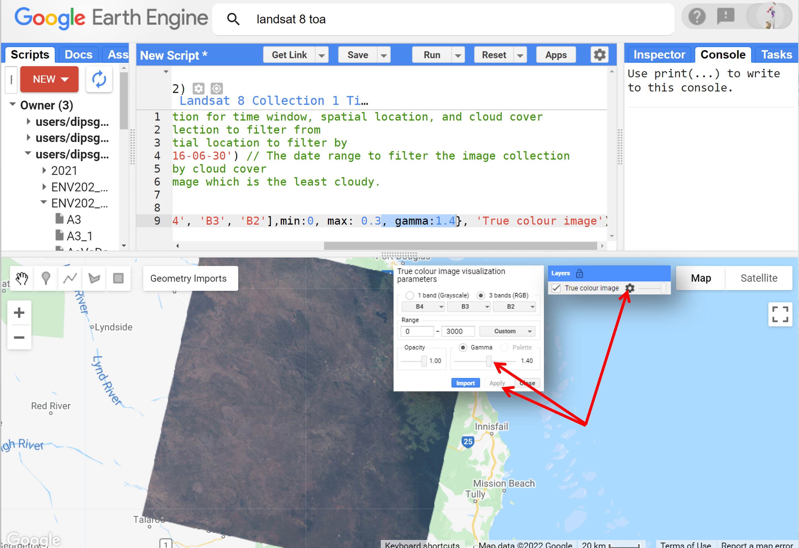

# Introductory Remote Sensing (ENV202/502)
Prac 4 - Plotting and analysing spectral response curves

### Acknowledgments
- [Earth Engine Beginning Curriculum](https://docs.google.com/document/d/1ZxRKMie8dfTvBmUNOO0TFMkd7ELGWf3WjX0JvESZdOE/edit#!)
- [Google Earth Engine guide](https://developers.google.com/earth-engine/guides)

### Objective

In previous pracs, we worked with Sentinel-2 imagery. In this prac, we will start working with the Landsat images. The working principle for both the Sentinel-2 and Landsat images are the same but with subtle differences due to their band positioning and corresponding differences in interpretation of the results. In today's prac, we will use the Landsat-8 image to further our understanding of spectral responses and develop skills in using the Charting functions in Earth Engine (JavaScript).

------------------------------------------------------------------------

## 1. Load up a Landsat-8 scene
1. In this prac we will work in the Cairns region of Queensland. Navigate to Cairns either by searching for Cairns or by zooming out and panning. 

2. Once you are in the Cairns region, place a marker on the map and rename it to "roi". We will use this marker to get a cloud-free Landsat-8 image. 


3. Search for and import the "USGS Landsat 8 Collection 1 Tier 1 TOA Reflectance" data into your scripting environment and rename the imported imageCollection to "l8". 

4. Now filter the Landsat-8 archive to pull up a cloud-free image for the Cairns region during May-June 2016 (adjust the dates as needed), and display the true colour composite


```JavaScript
//Filter the Landsat image collection for time window, spatial location, and cloud cover
var anImage = l8 // The image collection to filter from
    .filterBounds(roi) // The spatial location to filter by
    .filterDate('2016-05-01', '2016-06-30') // The date range to filter the image collection
    .sort('CLOUD_COVER') // Sort by cloud cover
    .first(); // Grab the first image which is the least cloudy.

//Add true-colour composite to map
Map.addLayer(anImage, {bands: ['B4', 'B3', 'B2'],min:0, max: 0.3}, 'True colour image');
```


5. A Landsat-8 scene size is 185 Km x 180 Km, the Sentinel-2 tile size is 100 Km x 100 Km. In comparison, the Landsat provides a bit larger coverage,  has more historical data, has thermal bands, 50+ years of data archive, but has a lower spatial and temporal resolution. For different applications, a different satellite can have a specific advantage and no one satellite provides the best of all specs. In the above script, notice some differences to our Sentinel-2 filtering. In Sentinel-2 we used the "CLOUD_COVERAGE_ASSESSMENT" keyword while for Landsat, we used the "CLOUD_COVER" keyword. Do you know how you as the user of the satellite data know which keyword to use? [hint - look into the image description window under "IMAGE PROPERTIES"].

6. Also note that to display the true colour, the min/max values are different to the Sentinel-2. Here we have a max of 0.3 while in Sentinel-2 we had a max of 3000. This is because the reflectance value in Landsat is stored between 0 and 1, while in Sentinel-2 the reflectance value is stored between 0 and 10000.

7. Have a look around the scene and familiarise yourself with the landscape. You'll notice the image is quite dark image - we can adjust the brightness/contrast using the settings wheels for the layer we created in the Layers tab. Slide the Gamma adjuster slightly to the right (from 1.0 to 1.4) to increase the brightness of the scene. Alternatively, in the previous line of script, you can encode the gamma value in the visualisation parameter as: "{bands: ['B4', 'B3', 'B2'],min:0, max: 3000, gamma:1.4}"  

```JavaScript
//Add true-clour composite to map
Map.addLayer(anImage, {bands: ['B4', 'B3', 'B2'],min:0, max: 0.3, gamma:1.4}, 'True colour image');
```


8. Note that the way we define min/max or gamma does not alter the actual data stored in the satellite image. These techniques are only for the visual purpose to make the image appear better to our eyes.

## 2. Define geometry regions of different landcover to plot the reflectance curve

1. Alright, now that we have found the image we want to work with, let's define the regions for different landcover that we want to plot the spectral reflectance curve of. Here, let's work with the following landcover types: forest, urban, water, bare land, and agriculture. Hover over the "Geometry Imports", click on ‘new layer’, select the rectangle geometry and draw a rectangular polygon over the waters.  After you are done, rename the "geometry" to  "water".


2. To plot the spectral reflectance curve, we need to change the geometry to feature. Click on the gear icon (settings) next to the water variable in our imported headings. Then, change the 'Import as'  from 'Geometry' to 'Feature'.  Use '+ property' and define Property as 'label' and value as the name of the class (e.g. water, urban, forest). Be consistent in the spelling, upper/lower case. 


3. Now repeat the above step 1 and 2 for other landcover types: forest, urban, bare land, and agriculture. By the end, you should have five landcover types defined as below. 


4. Now specify the bands that you want to use to construct the spectral reflectance curve. The Landsat-8 has 11 bands. You can use all the available bands or use selected bands. Look into the available bands and think about if some bands are useful for a specific landcover type. In the below script, I have used bands 1-7 which include the bands 1-7 which include the Costal blue, blue, green, red, NIR, SWIR1 and SWIR2, which suffice for the landcover type that we are interested in.

```JavaScript
//Choose bands that you want to include in the spectral reflectance curve 
var bandsToPlot = anImage.select('B[1-7]'); 
```

## 3. Charting of the spectral reflectance curve
1. We want to chart the spectral reflectance curve of the 5 landcover types together, so, we need to merge all the 5 landcover features into a feature collection. Use the script below. 

```JavaScript
// Define the feature collection to use to extract the spectral reflectance curve
var landCoverRegions = ee.FeatureCollection([water,forest,urban,bareland,agriculture ]);
```
2. Now we can create a chart variable and then print the chart to the console. We use the image.regions function to summarise by landcover class region, and the ee.Reducer.mean() function to obtain the mean reflectance value for each landcover class for each band.


```JavaScript
// Create the reflectance chart
var reflectanceChart = ui.Chart.image.regions({
    image:bandsToPlot, // the image where to grab the reflectance data from
    regions:landCoverRegions, // the regions within the image to sample from
    reducer:ee.Reducer.mean(), // the reducer here we compute mean reflectance
    seriesProperty: 'label'}); // use the labelproperty we defined earlier as the legend

// Now print the chart. You need to print to see the chart
print(reflectanceChart);

```


3. The script prints the reflectance chart into the console. You can view the chart in the console or expand the chart into a new tab to view and interact with the chart. You also have the option to download the chart data into CSV format or download the chart figure.


**Question:** *Why does the urban chart have the characteristics of the vegetation chart? i.e. absorption in B4 (Red) and high reflectance in B5 (NIR)?*

4. Great we have a chart. We can download the chart data in CSV format and produce our desired graph. The chart in its current form is not easy to read. Let's improve the readability of the above chart by specifying correct labels and titles, ticks, colours, etc. Let's start by defining what x-axis ticks are going to be. e.g. instead of B1, B2, ..., B7 as in the above figure, let's use the actual band wavelengths on the x-axis using this:

```JavaScript
// Define a list of Landsat-8 wavelengths for the Bands 1-7 to display in X-axis labels.
var wavelengths = [443, 482, 562, 655, 865, 1609, 2201];

```

5. Now let's define all the other parameters (axis titles, line style, point style) using the script below
 
```JavaScript
// Define the axis labels, title, linewidth, pointsize and line color.
var plotOptions = {
  title: 'Landsat-8  Surface reflectance spectra', // title of the chart
  hAxis: {title: 'Wavelength (nanometers)'}, // horizontal axis title
  vAxis: {title: 'Reflectance'}, // vertical axis title
  lineWidth: 1, // width of the line in the chart
  pointSize: 4, // display the reflectance values using a poitn sized 4
  series: { // color of the different lines
    0: {color: 'blue'}, // Water chart in blue
    1: {color: 'green'}, // Forest chart in green
    2: {color: 'red'}, // Urban chart in red
    3: {color: 'yellow'}, // Bareland chart in yellow
    4: {color: 'purple'} // Agriculture chart in purple
}};

```

6. Okay now rechart the spectral reflectance curve (as we did in step 1). But this time around we will use all the chart parameters that we defined in steps 2 and 3. 

```JavaScript
// Create the reflectance chart
var reflectanceChart1 = ui.Chart.image.regions({
    image:bandsToPlot, // the image where to grab the reflectance data from
    regions:landCoverRegions, // the regions within the image to sample from
    reducer:ee.Reducer.mean(), // the reducer here we compute mean reflectance
    seriesProperty: 'label', // use the labelproperty we defined earlier as the legend
    xLabels: wavelengths}) // use wavelength value instead of B1--B7
    .setOptions(plotOptions);
// Now print the chart
print(reflectanceChart1);
```


7. On the top right corner of the chart you have a pop-up button (highlighted in the previous figure). Click on the button that will open the chart in the next chrome tab. In this tab, as we had earlier, an option to save the figure as PNG or download the raw chart data in CSV. 


8. Look into the chart and think about the spectral characteristics of different landcover types and how different wavelength interacts with the different landcover types. Refer to the lecture and reading materials in the lecture to develop a detailed understanding. What do you learn from this chart? Do the spectral reflectance curve look similar to what we expect from our textbook understanding of the spectral reflectance curve. Do you see any anomalies (absorption/reflectance) that you find hard to understand? E.g. Why does agriculture have higher NIR reflectance compared to the forest? What factors do you think might induce errors in the spectral reflectance of different landcover? Are your ROI a true representation of the landcover that is defined?

## 4. Exercises for you

- Try and plot spectra for a Sentinel-2 image, instead of a Landsat-8 one.
- Experiment with additional landcover classes 
- After completing this prac, you are ready to attempt Assessment#2. 

## 5. Complete script
```JavaScript
//Filter the Landsat image collection for time window, spatial location, and cloud cover
var anImage = l8 // The image collection to filter from
    .filterBounds(roi) // The spatial location to filter by
    .filterDate('2016-05-01', '2016-06-30') // The date range to filter the image collection
    .sort('CLOUD_COVER') // Sort by cloud cover
    .first(); // Grab the first image which is the least cloudy.

//Add true-colour composite to map
Map.addLayer(anImage, {bands: ['B4', 'B3', 'B2'],min:0, max: 0.3, gamma:1.4}, 'True colour image');

//Choose bands that you want to include in the spectral reflectance curve 
var bandsToPlot = anImage.select('B[1-7]'); 
// Define the feature collection to use to extract the spectral reflectance curve
var landCoverRegions = ee.FeatureCollection([water,forest,urban,bareland,agriculture ]);

// Create the reflectance chart
var reflectanceChart = ui.Chart.image.regions({
    image:bandsToPlot, // the image where to grab the reflectance data from
    regions:landCoverRegions, // the regions within the image to sample from
    reducer:ee.Reducer.mean(), // the reducer here we compute mean reflectance
    seriesProperty: 'label'}); // use the labelproperty we defined earlier as the legend

// Now print the chart. You need to print to see the chart
print(reflectanceChart);


// Define a list of Landsat-8 wavelengths for X-axis labels.
var wavelengths = [443, 482, 562, 655, 865, 1609, 2201];

// Define the axis labels, title, linewidth, pointsize and line color.
var plotOptions = {
  title: 'Landsat-8  Surface reflectance spectra', // title of the chart
  hAxis: {title: 'Wavelength (nanometers)'}, // horizontal axis title
  vAxis: {title: 'Reflectance'}, // vertical axis title
  lineWidth: 1, // width of the line in the chart
  pointSize: 4, // display the reflectance values using a poitn sized 4
  series: { // color of the different lines
    0: {color: 'blue'}, // Water chart in blue
    1: {color: 'green'}, // Forest chart in green
    2: {color: 'red'}, // Urban chart in red
    3: {color: 'yellow'}, // Bareland chart in yellow
    4: {color: 'purple'} // Agriculture chart in purple
}};


// Create the reflectance chart
var reflectanceChart1 = ui.Chart.image.regions({
    image:bandsToPlot, // the image where to grab the reflectance data from
    regions:landCoverRegions, // the regions within the image to sample from
    reducer:ee.Reducer.mean(), // the reducer here we compute mean reflectance
    seriesProperty: 'label', // use the labelproperty we defined earlier as the legend
    xLabels: wavelengths}) // use wavelength value instead of B1--B7
    .setOptions(plotOptions);
// Now print the chart. You need to print to actually see the chart
print(reflectanceChart1);

```

-------
### Thank you

I hope you found this prac useful. A recorded video of this prac can be found on your learnline.
Coming up next week: Analysis of spectral reflectance curve.

#### Kind regards, Deepak Gautam
------
### The end
