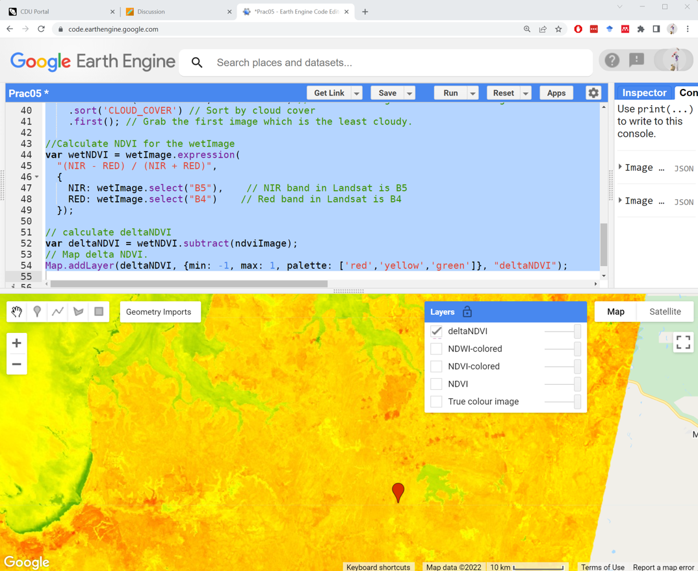

# Introductory Remote Sensing (ENV202/502)
Prac 5 - Introduction to Google Earth Engine and basic JavaScript


### Acknowledgments 
- [Earth Engine Beginning Curriculum](https://docs.google.com/document/d/1ZxRKMie8dfTvBmUNOO0TFMkd7ELGWf3WjX0JvESZdOE/edit#!)
- [Google Earth Engine guide](https://developers.google.com/earth-engine/guides)

### Objective

In the last prac, we started working with Landsat images and looked into spectral reflectance of various landcover types. Today, we will continue our journey of working with Landsat-8 images and look into indices to analyse the condition of our landscape. We will specifically look into NDVI (Normalised Difference Vegetation Index) and NDWI (Normalised difference water index). The earlier provides insight into the vegetation cover, vigour, and health, the latter provides insight into the dryness of our landscape including vegetation.

---------------------------------------------------

## 1. Loading and displaying satellite images. 
1. Similar to what we did in Prac04, I want you to put a marker geometry in the Litchfield National Park region, rename the geometry to "roi", import Landsat-8 tier 1 TOA image collection, rename the image collection to l8, filter the image collection to get a cloud-free image from dry season (Apr-Sep) of 2016, and display the true colour composite to your mapping pane.  

```JavaScript
//Filter the Landsat image collection for time window, spatial location, and cloud cover
var anImage = l8 // The image collection to filter from
    .filterBounds(roi) // The spatial location to filter by
    .filterDate('2016-04-01', '2016-09-30') // The date range to filter the image collection
    .sort('CLOUD_COVER') // Sort by cloud cover
    .first(); // Grab the first image which is the least cloudy.

//Add true-colour composite to map
Map.addLayer(anImage, {bands: ['B4', 'B3', 'B2'],min:0, max: 0.3}, 'True colour image');
```


## 2. Computation of normalised difference vegetation index (NDVI)
1. We learnt about the NDVI index in our lecture. Here, we will learn how to compute and map the NDVI over a landscape region. First, do you recall the formula to compute the NDVI? The formula is (NIR-RED)/(NIR+RED).

2. Now, what you need to know is, to find out how the NIR and Red bands are called in Landsat-8 images. Find that out. Hint hint [image description window, Prac01].

3. Now we are ready to compute the NDVI, we need to use a function available in the GEE called "expression". To read more about the function, you can go to the Docs tab and search or find "ee.Image.expression".


4. You also need to have the ability to learn about specific functions/commands in GEE by simply googling it. The Google Earth Engine Reference has detailed explanations and examples for most of their functions. In future, if you are stuck with a specific command/function, make sure to look under the Docs tab as well as google it. 


5. Paste the following lines below the ones you’ve already added, and click "Run". NDVI values range from 0 to 1, and the higher the value the more "vigorous" the vegetation.

```JavaScript
//Define variable NDVI from equation
var ndviImage = anImage.expression(
  "(NIR - RED) / (NIR + RED)",
  {
    NIR: anImage.select("B5"),    // NIR band in Landsat is B5
    RED: anImage.select("B4")    // Red band in Landsat is B4
  });
```

6. If you run the script, you don't see anything new happening. This is because we have computed the NDVI but have not asked to display it. To display the NDVI image, we need to use Map.addLayer command. Here, you can use the displaying skills you learned for a single band image in Prac02. The above computed "ndviImage" is a single band image containing NDVI values for each pixel. 

```JavaScript
// Add the NDVI image to the map, using the visualization parameters.
Map.addLayer(ndviImage, {min: 0, max: 1}, "NDVI");
```


7. That's our NDVI map, the darker pixel represents a lower NDVI value which is the absence of vegetation. The brighter pixel represents a higher NDVI value or abundance of photosynthetically active vegetation. However, the map is not easy to visually comprehend. Let's add a colour palette to our NDVI map. We have already learnt how to add a colour palette to a single band image. Let's do that here again. 

```JavaScript
// Add color palette to the NDVI image.
Map.addLayer(ndviImage, {min: 0, max: 1, palette: ['red','yellow','green','darkgreen']}, "NDVI-colored");
```


8. Explore different parts of the image and see how NDVI values vary with different substrate types. The higher NDVI is displayed in green-darkgreen colour. The lower NDVI is displayed in red-yellow colour. The red pixels represent the absence of the vegetation, yellow colours shows the area with sparse and/or dry vegetation, green and darkgreen colour represent the healthy vegetation.

**Question***Now that you have the above script, how do you compute NDVI from a completely different region? Try it for yourself*

9. I can now move the roi geometry to anywhere in the globe to obtain the NDVI map from that region. Click, drag, and drop the geometry to move to a new location. In the below example, I have moved the roi to the Tully region of Queensland which has massive sugar cane and banana plantations. The bright green colour represents the healthy and vigorous plantation while the yellow and red colour could be the sparse or harvested plantation. 

10. I encourage you to play with the NDVI mapping, alter the date range, and explore regions that might be interesting to you - perhaps your hometown. And think about what could the colours represent. Once you are proficient with NDVI mapping, move the marker back to the Litchfield National Park region for the upcoming steps.  

## 3. Normalised Difference Water Index

1. We have learnt about NDWI in the lecture and you have reading material on NDWI available on your Learnline. Now, that we have a working NDVI script above, the easiest way to compute and map the NDWI is by borrowing the above script and making modifications where necessary. I encourage you to do the modification yourself. This is crucial in your learning process as well as completing the assignments. So, please complete the NDWI computation and mapping and check below if you have done it correctly.

2. First of all, what you need to figure out is the formula for NDWI and the corresponding bands. By looking at the lecture, I can see the formula for NDWI is (NIR-SWIR)/(NIR+SWIR). That's great, but Landsat-8 has two SWIR bands at about 1600 and 2200 nanometers. So, check back on the NDWI reference to find out if you need to use the SWIR1 or SWIR2 band. 

3. Now, that you have identified the bands, you need to find out how those bands are referred to in GEE. Look into the data description window - under the bands tab. The NIR band is called "B5" and the SWIR band is called "B6". 

4. Now you are ready to copy the NDVI script from above and do the modification. Use the below script to check if you can make all the modifications on your own.

```JavaScript
//Define variable NDWI from equation
var ndwiImage = anImage.expression(
  "(NIR - SWIR) / (NIR + SWIR)",
  {
    NIR: anImage.select("B5"),    // NIR band in Landsat is B5
    SWIR: anImage.select("B6")    // SWIR band in Landsat is B6
  });

// Add a colour palette to the NDWI image.
Map.addLayer(ndwiImage, {min: -0.3, max: 0.3, palette: ['brown','red','lightgreen','darkgreen','darkblue']}, "NDWI-colored");
```


5. NDWI is a measure of liquid water molecules in vegetation canopies. NDWI is sensitive to the total amounts of liquid water in the landscape including vegetation. For example, the water bodies and the well-watered vegetation (e.g. riparian) appear dark blue in the above image, the gradient of vegetation dryness is observed in lightgreen and darkgreen colours whereas the red and brown colours represent the driest of the landscape perhaps the bare land with sparse or no vegetation. In the above script, I have played around with the min and max to enhance the features in the landscapes. You can always alter them to enhance the contrast on specific features.

6. Don't forget to save your script.

## 4. Exercise for you.
1. Similar to above, filter and obtain a wet season cloud-free image (2015 October - 2016 March) from the same location - call it wetImage.

2. Calculate NDVI - call it wetNDVI to avoid confusion.

3. Subtract the wetNDVI with the NDVI (from the dry season) and call it deltaNDVI.

4. Map the deltaNDVI which will show how the vegetation condition has changed from the wet to the dry season. What do you observe? Do you see interesting patterns on your map? Below is what I got after subtracting the wet and dry NDVI images.

```JavaScript
// Exercise fo you
// Obtain the wet image
var wetImage = l8 // The image collection to filter from
    .filterBounds(roi) // The spatial location to filter by
    .filterDate('2015-10-01', '2016-03-31') // The date range to filter the image collection
    .sort('CLOUD_COVER') // Sort by cloud cover
    .first(); // Grab the first image which is the least cloudy.
    
//Calculate NDVI for the wetImage
var wetNDVI = wetImage.expression(
  "(NIR - RED) / (NIR + RED)",
  {
    NIR: wetImage.select("B5"),    // NIR band in Landsat is B5
    RED: wetImage.select("B4")    // Red band in Landsat is B4
  });    

// calculate deltaNDVI
var deltaNDVI = wetNDVI.subtract(ndviImage);
// Map delta NDVI.
Map.addLayer(deltaNDVI, {min: -1, max: 1, palette: ['red','yellow','green']}, "deltaNDVI");
```


5. What you see is the change in NDVI (wet-dry). So, all the green pixels represents the area where NDVI has increased through time. The yellow pixels represents the area where NDVI has remained almost similar, and the red pixels represent the decrease in NDVI value. You also need to interpret the images based on not just wet and dry but in the context of when the image was captured. The wet image happens to be captured at the end of the dry season in 20151002 while the dry image happens to be captured towards the start of the dry season 20160513.  
 
## 5. The complete script used in this Prac


```JavaScript
var anImage = l8 // The image collection to filter from
    .filterBounds(roi) // The spatial location to filter by
    .filterDate('2016-04-01', '2016-09-30') // The date range to filter the image collection
    .sort('CLOUD_COVER') // Sort by cloud cover
    .first(); // Grab the first image which is the least cloudy.

//Add true-colour composite to map
Map.addLayer(anImage, {bands: ['B4', 'B3', 'B2'],min:0, max: 0.3}, 'True colour image');

//Define variable NDVI from equation
var ndviImage = anImage.expression(
  "(NIR - RED) / (NIR + RED)",
  {
    NIR: anImage.select("B5"),    // NIR band in Landsat is B5
    RED: anImage.select("B4")    // Red band in Landsat is B4
  });
  
// Add the NDVI image to the map, using the visualization parameters.
Map.addLayer(ndviImage, {min: 0, max: 1}, "NDVI");

// Add colour palette to the NDVI image.
Map.addLayer(ndviImage, {min: 0, max: 1, palette: ['red','yellow','green','darkgreen']}, "NDVI-colored");

//Define variable NDWI from equation
var ndwiImage = anImage.expression(
  "(NIR - SWIR) / (NIR + SWIR)",
  {
    NIR: anImage.select("B5"),    // NIR band in Landsat is B5
    SWIR: anImage.select("B6")    // SWIR band in Landsat is B6
  });

// Add a colour palette to the NDWI image.
Map.addLayer(ndwiImage, {min: -0.3, max: 0.3, palette: ['brown','red','lightgreen','darkgreen','darkblue']}, "NDWI-colored");

// Exercise fo you
// Obtain the wet image
var wetImage = l8 // The image collection to filter from
    .filterBounds(roi) // The spatial location to filter by
    .filterDate('2015-10-01', '2016-03-31') // The date range to filter the image collection
    .sort('CLOUD_COVER') // Sort by cloud cover
    .first(); // Grab the first image which is the least cloudy.
    
//Calculate NDVI for the wetImage
var wetNDVI = wetImage.expression(
  "(NIR - RED) / (NIR + RED)",
  {
    NIR: wetImage.select("B5"),    // NIR band in Landsat is B5
    RED: wetImage.select("B4")    // Red band in Landsat is B4
  });    

// calculate deltaNDVI
var deltaNDVI = wetNDVI.subtract(ndviImage);
// Map delta NDVI.
Map.addLayer(deltaNDVI, {min: -1, max: 1, palette: ['red','yellow','green']}, "deltaNDVI");
```
-------
### Thank you

I hope you found this prac useful. A recorded video of this prac can be found on your learnline. After this prac, you are ready to complete Assignment#2.  Coming up next week: image classification and accuracy assessment.

#### Kind regards, Deepak Gautam
------
### The end
