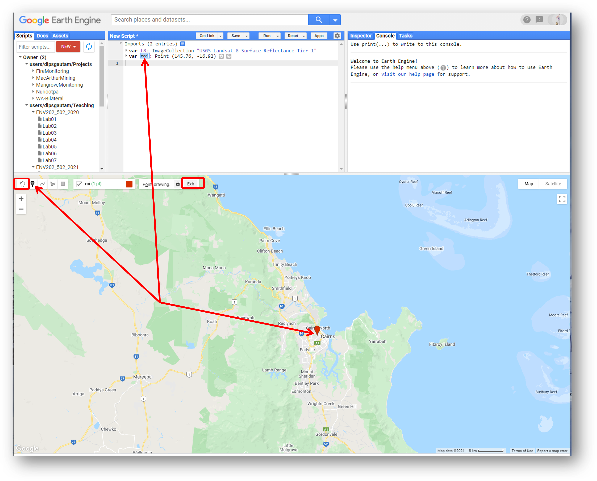
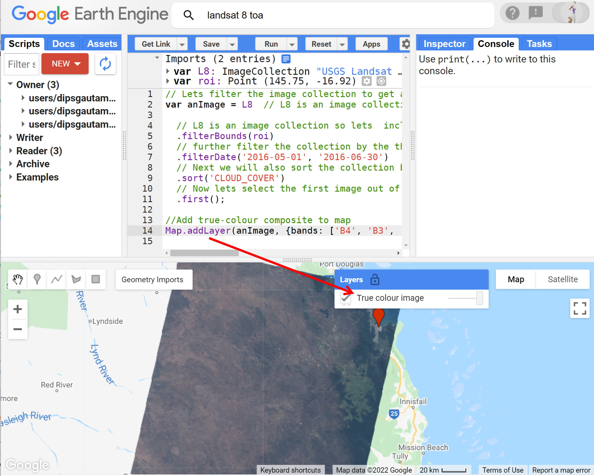
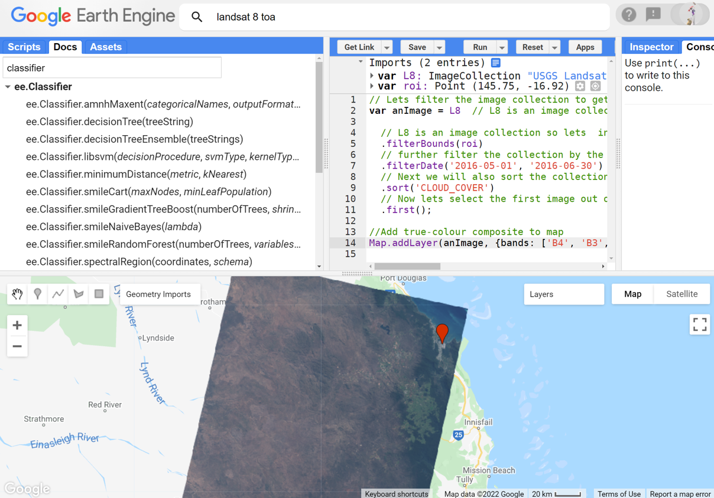
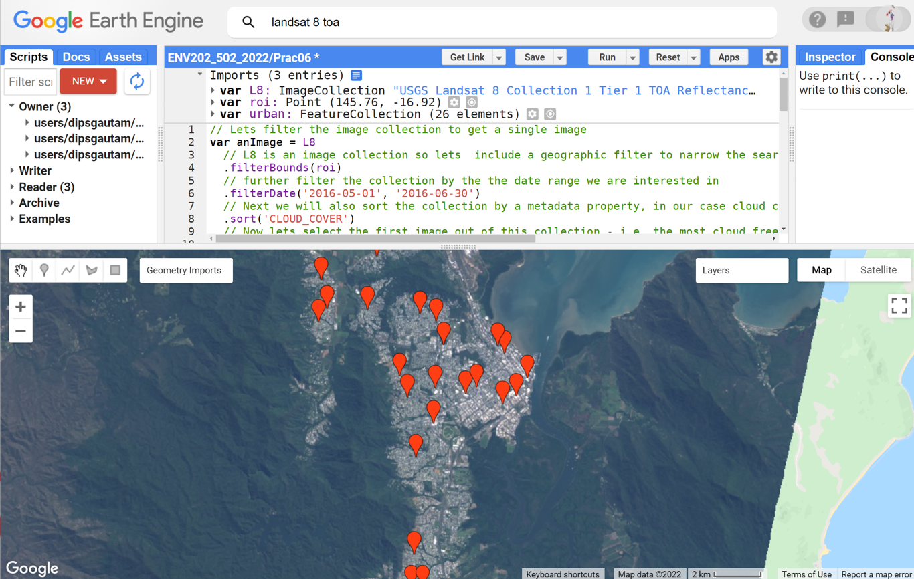
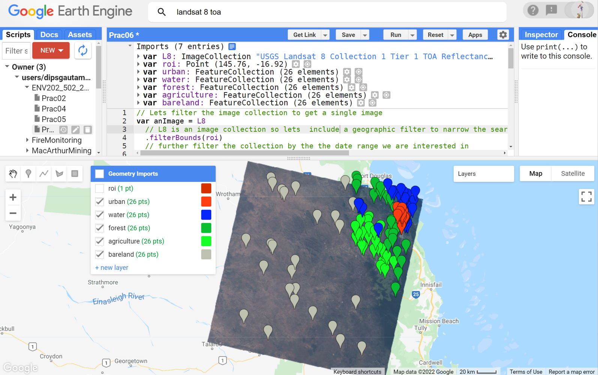
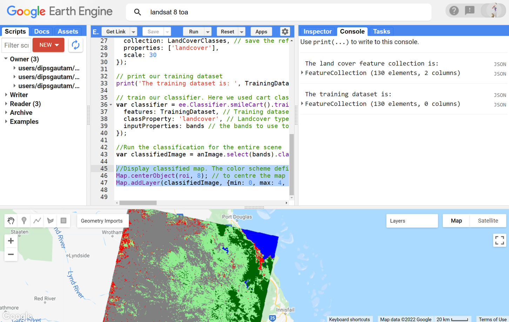

# Introductory Remote Sensing (ENV202/502)
Prac 6 - Image Classification - part 1


### Acknowledgments 
- [Earth Engine Beginning Curriculum](https://docs.google.com/document/d/1ZxRKMie8dfTvBmUNOO0TFMkd7ELGWf3WjX0JvESZdOE/edit#!)
- [Google Earth Engine guide](https://developers.google.com/earth-engine/guides)
- David Saah and Nicholas Clinton

### Objective

The objective of this prac is to gain an understanding of the image classification process and explore ways of turning remotely sensed imagery into landcover maps.

---------------------------------------------------

## 1. Loading up the Landsat 8 image

1. The first step is to get a cloud-free image with which to work. We have already started working with Landsat images in previous pracs. Today Prac will again use the Landsat 8 image. Look for "USGS Landsat 8 Collection 1 Tier 1 TOA Reflectance" imagery, import it, and rename the imageCollection to L8. Refer to previous pracs if you don't know how to search for, import, and rename imageries.

2. Use the marker geometry tool (teardrop icon) from the geometry tools and draw a single point in the region of interest - let's use the town of Cairns for this example.  Then 'Exit' from the drawing tools or select the hand icon.  Note that a new variable is created in the imports section, containing the single point, imported as a Geometry.  Change the name of this import to "roi" - short for region of interest.



3. Filter the image collection spatially (using the filterBounds command), temporally (using the filterDate command), and lastly sort the images by cloud cover (using the 'CLOUD_COVER' keyword) and extract the least cloudy scene (using the "first" command). Run the script below to extract our desired image from the Landsat 8 collection and add it to the map view as a true-colour composite:

```JavaScript
// Lets filter the image collection to get a single image
var anImage = L8
  // L8 is an image collection so lets  include a geographic filter to narrow the search to images at the location of our point
  .filterBounds(roi)
  // further filter the collection by the the date range we are interested in
  .filterDate('2016-05-01', '2016-06-30')
  // Next we will also sort the collection by a metadata property, in our case cloud cover is a very useful one
  .sort('CLOUD_COVER')
  // Now lets select the first image out of this collection - i.e. the most cloud free image in the date range and over the region of interest
  .first();

//Add true-colour composite to map
Map.addLayer(anImage, {bands: ['B4', 'B3', 'B2'],min:0, max: 0.3, gamma:1.4}, 'True colour image');
```



4. Have a look around the scene and familiarise yourself with the landscape. Can you visually identify urban, water, forest, agriculture, and bareland areas? Before moving forward, think about why would anyone want to classify an image? We can already tell distinguish different landcover types even before classification. So why bother classifying?  

## 2. Gathering training data for classification

1. In this unit, we will practice supervised classification. Do you remember what a supervised classification is? Well, it involves gathering the training data, training the classifier, performing classification, and analysis of accuracy. If you go into "Docs" and type classifier, you will see that there are several classifiers available in GEE for us. The principle of classification on any of these classifiers is the same: training data, training, classification, accuracy analysis. We will use the smileCart classifier in this prac, but feel free to explore others. We also briefly learned several of these classifiers in the lecture.



2. Alright, now that you know what classifier is there, let's start gathering the training dataset. So, what is a training dataset? It is like a sample dataset where we tell the classifier how to identify different landcover. When collecting the training dataset, we want to collect representative samples of reflectance spectra for each landcover class of interest. We will first gather a training dataset for one landcover type and then repeat that for other landcover types. Let's do the easy one first - the urban. Hover on the 'Geometry Imports' box next to the geometry drawing tools and click '+ new layer.' The new layer will be imported to the "Geometry Import" box as well as to the import section of your script. Rename the new layer to 'urban'. Notice that the renaming will change the name of the layer in the "Geometry Imports" box.


3. Now, zoom into the "True colour image" layer, pan as needed to select pixels that represent the urban area or built-up areas (buildings, roads, parking lots, etc.). Clicking on the urban area will collect the training data for the urban. Sample minimum of 25 points. For robust classification make sure you are sampling from different types of urban areas (not just one). See the example below.  



4. Next you need to configure the urban geometry import (cog-wheel, top of the script in imports section) as follows.  Click the cog-wheel icon to configure it, change 'Import as'  from 'Geometry' to 'FeatureCollection'.  Use 'Add property' landcover and set its value to 0.  (Subsequent classes will be 1, 2, 3 etc.). You can also change the colour of the 'teardrops', here if you like. When finished, click 'OK'.


5. Now, repeat steps 2-4 for each land cover class: 'water', 'forest', 'agriculture', and 'bareland'.  Collect >25 points for each class. Use the cog-wheel to configure the geometries - change the type to FeatureCollection and set the property name to landcover with values of 1, 2, 3, and 4 for the different classes. Note that in the past students have struggled by not being consistent in their naming, make sure your naming is consistent e.g. "urban" vs "Urban", "landcover" vs "Landcover". By the end, you should have the 5 classes, each with 25+ training data, spread throughout the image - see example below.



6. Now we have five classes defined (urban, water, forest, agriculture, bareland), but before we can use them to collect training data (i.e. spectral values from each of those points), we need to merge the 5 landcover features into a single collection, called a FeatureCollection. Run the following line to merge the geometries into a single FeatureCollection:

```javascript
// Merge the 5 landcover class features into a single featureCollection
var LandCoverClasses = urban.merge(water).merge(forest).merge(agriculture).merge(bareland);
```

7. You can also print the feature collection and inspect the features using the print command. Each of the features has a different ID and the landcover number you assigned earlier. 

```javascript
// Print the land cover feature collection
print('The land cover feature collection is: ',LandCoverClasses);
```


## 3. Creating the training data

1. So far, we have defined where to gather the training data from. However, we have not yet defined what to gather in the training dataset. Do you know what we want to gather? That's right, it is the spectral reflectance values. So, the classifier will learn about different landcover by looking at their spectral reflectance values in the *feature space*. But first, what bands do we want to let the classifier learn from? Is it a good practice to just dump all the bands for the classifier to learn from? Or, do we want to be strategic and think about which bands might be useful in the context of the landcover we are interested in? - it is the latter. For the landcover, sampling of the visible, near infrared, and SWIR bands will suffice. Let's define those bands and sample them at the geometries we have defined and from the Landsat 8 image. 

```javascript
// These will be the bands whose reflectance data will be sampled from the image for training purpose
var bands = ['B2', 'B3', 'B4', 'B5', 'B6', 'B7'];

// add new properties to the "LandCoverClasses" - the new property is the reflectance data from the above bands
TrainingDataset = anImage.select(bands).sampleRegions({ // sample the reflectance from selected bands
  collection: LandCoverClasses, // save the reflectance to the LandCoverClasses
  properties: ['landcover'],
  scale: 30
});

// print our training dataset
print('The training dataset is: ', TrainingDataset);
```

2. That's it- that's all you need to do when you sample the training dataset. After running the script the training data will be printed to the console. To see what new has happened, you can expand the printed information. You will notice that new 'properties' information has been added to the feature collection. The properties contain exactly the band numbers we defined above.


## 4. Train the classifier and run the classification

1. So far, we have sampled the training dataset. Now we can train the classifier using the training dataset above information. Here, we will train the smileCart classifier. I encourage you to try other classifiers too.

```javascript
// train our classifier. Here we used cart classifier.
var classifier = ee.Classifier.smileCart().train({
  features: TrainingDataset, // Training dataset to use
  classProperty: 'landcover', // Landcover types to train
  inputProperties: bands // the bands to use to train.
});

```

2. The next step is then to apply this knowledge from our training to the rest of the image (i.e. the pixels that we did not use for training) - using what the classifier learnt from our supervised collection, it will decide on all the other pixels on assigning a class to them. 

```javascript
//Run the classification for the entire scene
var classifiedImage = anImage.select(bands).classify(classifier);
```

3. At this point, classification has happened in the GEE - it is quite fast. However, we haven't asked to display the classified map to our mapping layer. Use the Map.addLayer function to display the results as below. You may need to adjust the colours, but if the training data have been created with urban=0, water=1, forest=2, agriculture=3, and bareland =4  - then the result will be rendered with those classes as red, blue and darkgreen, lightgreen, and grey respectively.


```javascript
//Display classified map. The colour scheme defined below is set according to the numbering of the class. e.g. class0 was urban which is set to red. Also, note that the max value is set to 4 as we have 5 classes.
Map.centerObject(roi, 8); // to centre the map display with roi in the middle. 8 is the zoom level
Map.addLayer(classifiedImage, {min: 0, max: 4, palette: ['red', 'blue', 'darkgreen','lightgreen', 'gray']}, 'Classified map');
```


4. Visually inspect if the classification has performed as expected. You can untick the landcover geometries within "Geometry Imports" to hide them. From the 'Geometry Import' box, untick all the geometries for better visualisation. Looks like there are several misclassifications in my map. I can see that agriculture has been over-represented in the map, the urban also seems to be overly present towards the western end of the image. Your classification result will not be the same as mine. Can you guess why? That's right because the location of the training dataset for you and me is not the same. Explore your map and think about where misclassification occurred and why would that be. 


5. To analyse individual classes, you can always apply a mask so, only one class is visible to your map. Below I have mapped the forest class in green. 
```JavaScript
// you can choose any of the individual classes to display. Here I am displaying class 2 which is forest.
Map.addLayer(classifiedImage.updateMask(classifiedImage.select('classification').eq(2)), {palette: ['green'], min: 0, max: 1},'Forest only');
```


6. Not too bad hey. Looks like the forest classification was reasonably okay. Now you can modify the script to check for other individual classes. 

7. Now that you have 5 different classes, you can also calculate the area of each class. For example, you are into forest management and want to know the forest area at a particular point in time, you could use the classified map to calculate the area as below.

```JavaScript
// Calculate the forest area in the landsat scene
var forestArea = classifiedImage.eq([2]).multiply(ee.Image.pixelArea()).reduceRegion({
 reducer:ee.Reducer.sum(),
  scale:30,
 bestEffort:true
});

// print the forest area after converting to Km2
print ('Forest area in (km²):', ee.Number(forestArea.get('classification')).divide(1e6));
```

8. I got a forest area of 5534 square Km. What did you get? With this skill, you can check the forest area or any other landcover area in any region at any given time. 
 
9. Congratulations on your first landcover classification! Zoom in explore and have fun. 
- Are you happy with the classification?
- How could the classification be improved?
- Would adding in extra landcover classes be helpful. 

## 5. Exercise for you
Pick one of the over-represented classes and try to improve it. One obvious thing you can try is to add an extra class which could help reduce the over-representation. For example, in my case, agriculture was over-represented. On closer inspection, I can see that a lot of shrublands was misclassified as agriculture. So, I could try and add Shrub as another class that could help improve the classification of agriculture. 


## 6. The complete script (excluding the ImageCollection, roi, and landcover features)
```JavaScript
// Lets filter the image collection to get a single image
var anImage = L8
  // L8 is an image collection so lets  include a geographic filter to narrow the search to images at the location of our point
  .filterBounds(roi)
  // further filter the collection by the the date range we are interested in
  .filterDate('2016-05-01', '2016-06-30')
  // Next we will also sort the collection by a metadata property, in our case cloud cover is a very useful one
  .sort('CLOUD_COVER')
  // Now lets select the first image out of this collection - i.e. the most cloud free image in the date range and over the region of interest
  .first();

//Add true-colour composite to map
Map.addLayer(anImage, {bands: ['B4', 'B3', 'B2'],min:0, max: 0.3, gamma:1.4}, 'True colour image');


// Merge the 5 landcover class features into a single featureCollection
var LandCoverClasses = urban.merge(water).merge(forest).merge(agriculture).merge(bareland);

// Print the land cover feature collection
print('The land cover feature collection is: ',LandCoverClasses);

// These will be the bands whose reflectance data will be sampled from the image for training purpose
var bands = ['B2', 'B3', 'B4', 'B5', 'B6', 'B7'];

// add new properties to the "LandCoverClasses" - the new property is the reflectance data from the above bands
var TrainingDataset = anImage.select(bands).sampleRegions({ // sample the reflectance from selected bands
  collection: LandCoverClasses, // save the reflectance to the LandCoverClasses
  properties: ['landcover'],
  scale: 30
});

// print our training dataset
print('The training dataset is: ', TrainingDataset);

// train our classifier. Here we used cart classifier.
var classifier = ee.Classifier.smileCart().train({
  features: TrainingDataset, // Training dataset to use
  classProperty: 'landcover', // Landcover types to train
  inputProperties: bands // the bands to use to train.
});

//Run the classification for the entire scene
var classifiedImage = anImage.select(bands).classify(classifier);

//Display classified map. The colour scheme defined below is set according to the numbering of the class. e.g. class0 was urban which is set to red. Also, note that the max value is set to 4 as we have 5 classes.
Map.centerObject(roi, 8); // to centre the map display with roi in the middle. 10 is the zoom level
Map.addLayer(classifiedImage, {min: 0, max: 4, palette: ['red', 'blue', 'darkgreen','lightgreen', 'gray']}, 'Classified map');

// you can choose any of the individual classes to display. Here I am displaying class 2 which is forest.
Map.addLayer(classifiedImage.updateMask(classifiedImage.select('classification').eq(2)), {palette: ['green'], min: 0, max: 1},'Forest only');

// Calculate the forest area in the landsat scene
var forestArea = classifiedImage.eq([2]).multiply(ee.Image.pixelArea()).reduceRegion({
 reducer:ee.Reducer.sum(),
  scale:30,
 bestEffort:true
});

// print the forest area after converting to Km2
print ('Forest area in (km²):', ee.Number(forestArea.get('classification')).divide(1e6));

```

-------
### Thank you

I hope you found this prac useful. A recorded video of this prac can be found on your learnline. After this prac, you are ready to complete Assignment#2.  Coming up next week: accuracy assessment.

#### Kind regards, Deepak Gautam
------
### The end
