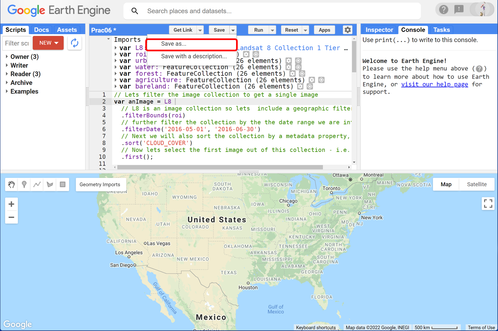
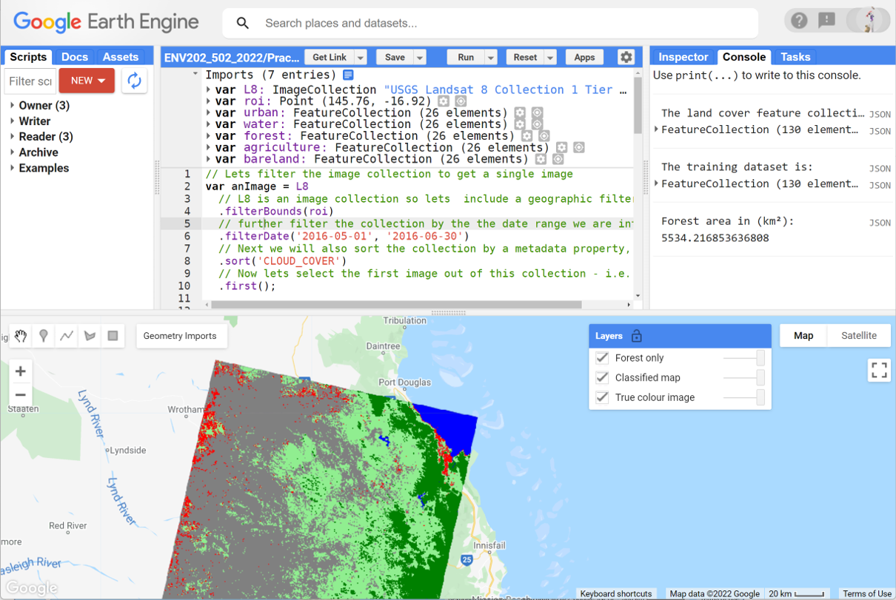
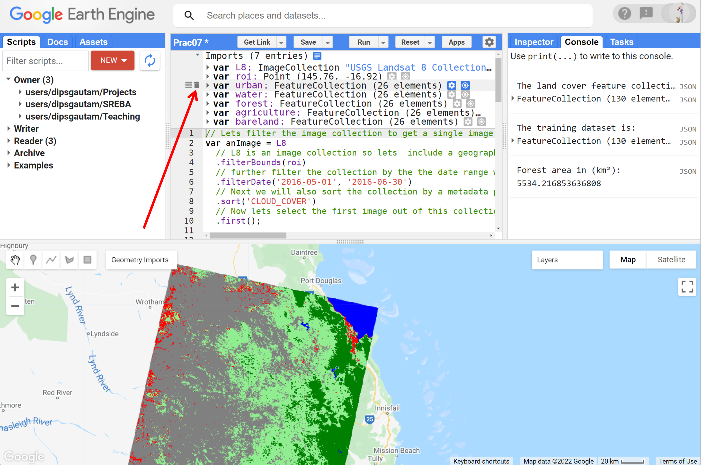
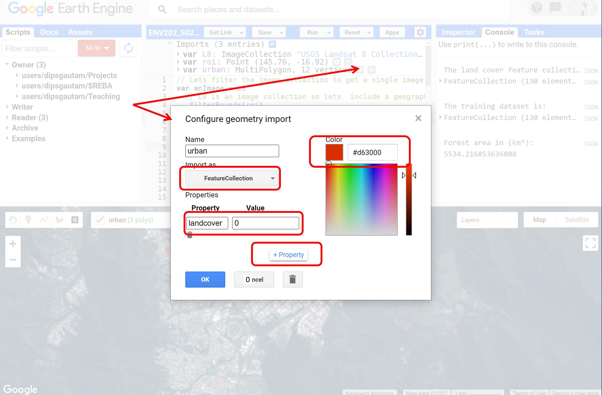
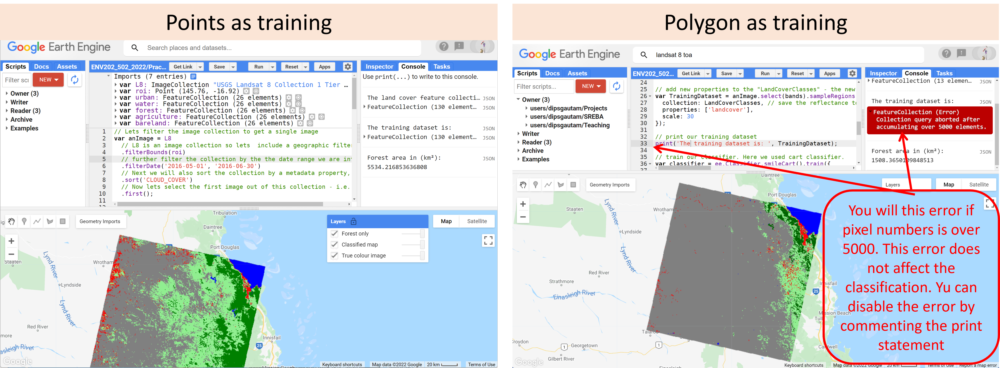
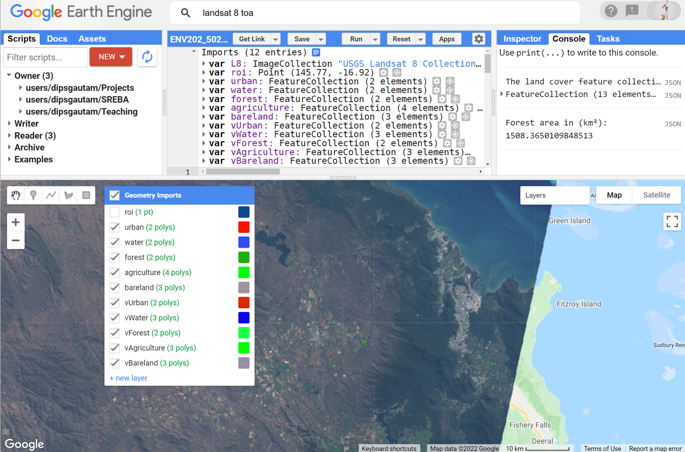
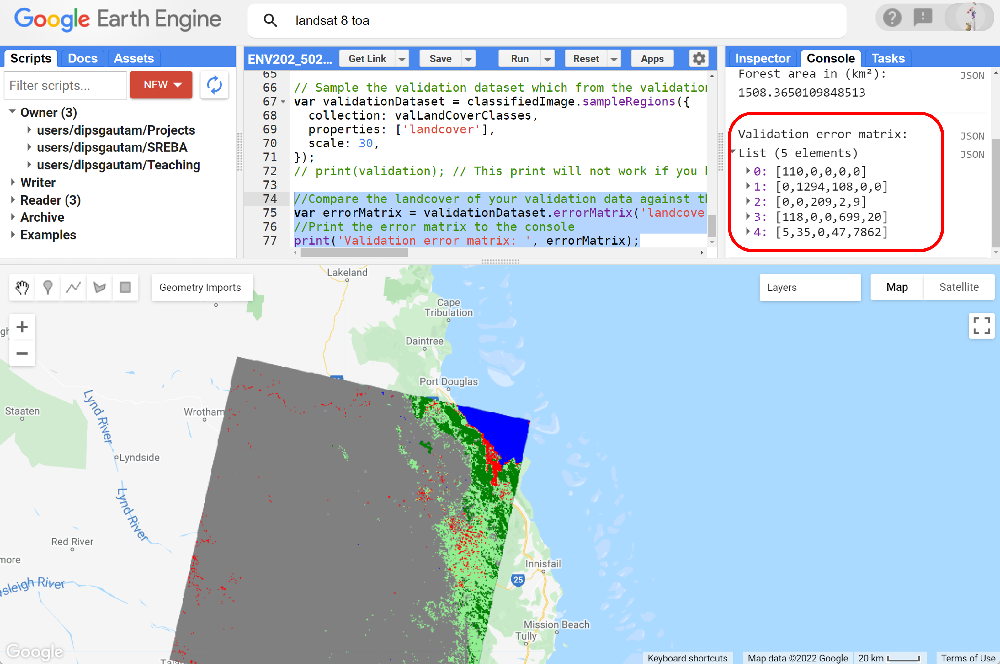
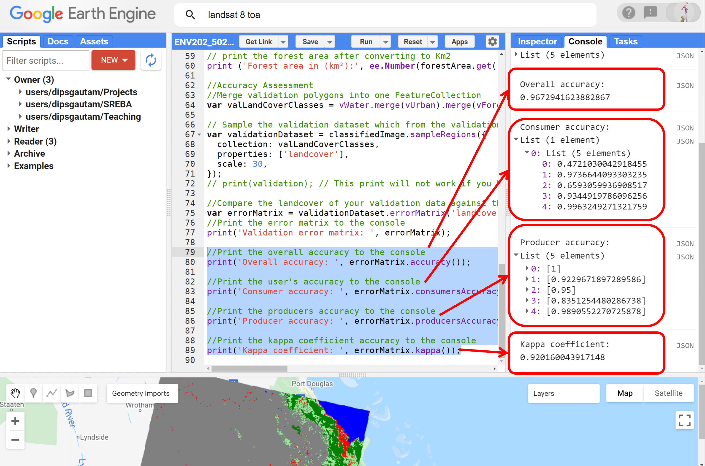

# Introductory Remote Sensing (ENV202/502)
Prac 6 - Image classification - part 2: validation and accuracy assessment


### Acknowledgments 
- [Earth Engine Beginning Curriculum](https://docs.google.com/document/d/1ZxRKMie8dfTvBmUNOO0TFMkd7ELGWf3WjX0JvESZdOE/edit#!)
- [Google Earth Engine guide](https://developers.google.com/earth-engine/guides)

### Objective
The objective of this Prac is to further your understanding of the image classification process, improve the classification from last week, learn how to evaluate image classification results and conduct an accuracy assessment using independent validation data.

---------------------------------------------------
## 1. Load up your previous classification work on Google EarthEngine

1. Open your script from the classification Part I prac (last week's Prac). Make any minor change (e.g. add an enter at the end of the script or add a space) so you can save the script under a new name (e.g. Prac07).



2. If you did not save the script from the Prac06, repeat the steps from [Prac 6](https://github.com/GautamDeepak/IRS/blob/main/IRS_Prac_06.md) and be sure to save it this time. I have provided the full code below, but remember that you need to manually collect the training data and assign landcover properties.
```JavaScript
//Let's filter the image collection to get a single image
var anImage = L8
  // L8 is an image collection so let's include a geographic filter to narrow the search to images at the location of our point
  .filterBounds(roi)
  // further filter the collection by the date range we are interested in
  .filterDate('2016-05-01', '2016-06-30')
  // Next we will also sort the collection by a metadata property, in our case cloud cover is a very useful one
  .sort('CLOUD_COVER')
  // Now let's select the first image out of this collection - i.e. the most cloud-free image in the date range and over the region of interest
  .first();

//Add true-colour composite to map
Map.addLayer(anImage, {bands: ['B4', 'B3', 'B2'],min:0, max: 0.3, gamma:1.4}, 'True colour image');


// Merge the 5 landcover class features into a single featureCollection
var LandCoverClasses = urban.merge(water).merge(forest).merge(agriculture).merge(bareland);

// Print the land cover feature collection
print('The land cover feature collection is: ',LandCoverClasses);

// These will be the bands whose reflectance data will be sampled from the image for training purpose
var bands = ['B2', 'B3', 'B4', 'B5', 'B6', 'B7'];

// add new properties to the "LandCoverClasses" - the new property is the reflectance data from the above bands
var TrainingDataset = anImage.select(bands).sampleRegions({ // sample the reflectance from selected bands
  collection: LandCoverClasses, // save the reflectance to the LandCoverClasses
  properties: ['landcover'],
  scale: 30
});

// print our training dataset
print('The training dataset is: ', TrainingDataset);

// train our classifier. Here we used cart classifier.
var classifier = ee.Classifier.smileCart().train({
  features: TrainingDataset, // Training dataset to use
  classProperty: 'landcover', // Landcover types to train
  inputProperties: bands // the bands to use to train.
});

//Run the classification for the entire scene
var classifiedImage = anImage.select(bands).classify(classifier);

//Display classified map. The colour scheme defined below is set according to the numbering of the class. e.g. class0 was urban which is set to red. Also, note that the max value is set to 4 as we have 5 classes.
Map.centerObject(roi, 8); // to centre the map display with roi in the middle. 10 is the zoom level
Map.addLayer(classifiedImage, {min: 0, max: 4, palette: ['red', 'blue', 'darkgreen','lightgreen', 'gray']}, 'Classified map');

// you can choose any of the individual classes to display. Here I am displaying class 2 which is forest.
Map.addLayer(classifiedImage.updateMask(classifiedImage.select('classification').eq(2)), {palette: ['green'], min: 0, max: 1},'Forest only');

// Calculate the forest area in the landsat scene
var forestArea = classifiedImage.eq([2]).multiply(ee.Image.pixelArea()).reduceRegion({
 reducer:ee.Reducer.sum(),
  scale:30,
 bestEffort:true
});

// print the forest area after converting to Km2
print ('Forest area in (km²):', ee.Number(forestArea.get('classification')).divide(1e6));

```
3. Run the script to get the classified map, map of individual class and its coverage area. 



4. This is where we left last week. This week we will build onto last weeks work by improving our training dataset. We will use polygon instead of points. And we will also perform an accuracy analysis. 

## 2. Use polygons instead of points to sample the training data.

1. Our existing training dataset is point-based. Let's delete all of them so we can sample from polygon. 



2. Now, follow the steps we learnt in Prac06 to re-sample the training data for classification - use polygon this time not point. Note you can sample more than one polygon for a landcover class. Start with urban landcover - do not exceed 5000 pixels. 


3. Follow the steps we learned in Prac06 to configure the urban polygon data. The configuration is the same as Prac06. If you are stuck, refer to Prac06



4. Repeat the above steps [step 2 and step 3] to define all the landcover types: let's add water, forest, agriculture, bareland – same order as Prac06


5. The polygons look very small at this zoom level, but they are there. Notice how I have sampled multiple but smaller polygons, which, potentially captures the variability within each class. 

6. Run the script to get a classified map. The script should just work without any modification as long as you have named the classes and properties exactly as the last prac. Here, the classifier used polygons instead of points for training. 


7. Compare the two classified maps where the training data was obtained from points vs the polygons. Do you notice any improvement? I can see that the agricultural area is drastically reduced while the bareland area has increased substantially. The forest and the urban area has shrunken as well. The dried streams in the outback have been classified as urban. Overall, this looks better. However, how do I know for sure that this is better or worse compared to the previous classified map? This is where the accuracy assessment comes in. With accuracy assessment, we can quantify the errors in the classification which then can be used to justify the improvement if any.   
## 3. Classification validation

1. Do you remember what do we need for the validation? - we need to sample the validation dataset. Normally this validation dataset would be something that is collected by going out in the field using GPS and recording different landcover types by actual observation. However, that's not possible to do here. So, we will sample the validation dataset in the same way we sampled the training dataset - by looking into the map. 
  - Sample the validation dataset in the same way you collected training data
  - collect validation data for the same classes but name them differently (vUrban, vWater, vForest, vAgriculture, vBareland)
  - do not overlap the validation data with training data
  - do not exceed 5000 pixels
  - use the same property names and labels number



2. To run the validation, we need to repeat some of the scripting steps. First, merge your validation polygons into one Feature Collection. Remember we did the same for the training dataset as well. You can add the following script below your existing script in Google Earth Engine. 

```JavaScript
//Merge validation polygons into one FeatureCollection
var valLandCoverClasses = vWater.merge(vUrban).merge(vForest).merge(vAgriculture).merge(vBareland);
```  
  
3. Again similar to the training dataset, sample your validation dataset. Note that this validation dataset is sampled from the classified image while the training dataset was sampled from the original image.  

```JavaScript
var validationDataset = classified.sampleRegions({
  collection: valLandCoverClasses,
  properties: ['landcover'],
  scale: 30,
});
// print(validation); // This print will not work if you have sampled over 5000 pixels.
```

4. Now run the accuracy assessment and obtain the error matrix. This will print the error matrix for you. Refer to the lecture and the reading materials to understand the error matrix also known as the confusion matrix.  

```JavaScript
//Compare the landcover of your validation data against the classification result
var errorMatrix = validationDataset.errorMatrix('landcover', 'classification');
//Print the error matrix to the console
print('Validation error matrix: ', errorMatrix);
```



5. Earth Engine also has built-in functions to compute accuracies such as User's and Producer's accuracy, kappa coefficient. Run the script below to compute the accuracies.

```JavaScript
//Print the overall accuracy to the console
print('Overall accuracy: ', errorMatrix.accuracy());

//Print the user's accuracy to the console
print('Consumer accuracy: ', errorMatrix.consumersAccuracy());

//Print the producers accuracy to the console
print('Producer accuracy: ', errorMatrix.producersAccuracy());

//Print the kappa coefficient accuracy to the console
print('Kappa coefficient: ', errorMatrix.kappa());
```


6. Think about how the classification went and what all these accuracies numbers mean.

## 4. Improving the Classification

Now you have the base accuracy assessment numbers. Are you happy with the classification result? How can we improve it and what are our options? Below are a few options for you to explore. Try them and if you are stuck, discuss them on the discussion board and get back to me in the next class.

1. Changing the training sample size: - We have already tried this. By incorporating polygons we are sampling from more than 25 pixels.

2. Changing the sampling strategy: - This is where you can try different sampling strategies we learned in the lecture. Try experimenting with a stratified sampling approach.

3. Changing the classifier: - We used a CART classifier, we could try a different approach such as a support vector machine (SVM) or randomForest (randomForest) approach (search for these commands in the docs section).

4. Changing the input bands: - We classified the landscape using 6 bands [B2--B7]. You could always add additional bands which may improve the classification. 

5. Adding derived indices as input: - In addition to the bands, you could try to add ancillary information, such as elevation data, or a derived index such as NDVI, NDWI which may help better discrimination between the classes. 

6. Changing the input image: - We used a winter scene from Landsat-8. We could try a summer scene from Landsat-8, or switch over to a Sentinel-2 image.

## 5. The complete script used in this Prac
```JavaScript
// Lets filter the image collection to get a single image
var anImage = L8
  // L8 is an image collection so lets  include a geographic filter to narrow the search to images at the location of our point
  .filterBounds(roi)
  // further filter the collection by the the date range we are interested in
  .filterDate('2016-05-01', '2016-06-30')
  // Next we will also sort the collection by a metadata property, in our case cloud cover is a very useful one
  .sort('CLOUD_COVER')
  // Now lets select the first image out of this collection - i.e. the most cloud free image in the date range and over the region of interest
  .first();

//Add true-colour composite to map
Map.addLayer(anImage, {bands: ['B4', 'B3', 'B2'],min:0, max: 0.3, gamma:1.4}, 'True colour image');


// Merge the 5 landcover class features into a single featureCollection
var LandCoverClasses = urban.merge(water).merge(forest).merge(agriculture).merge(bareland);

// Print the land cover feature collection
print('The land cover feature collection is: ',LandCoverClasses);

// These will be the bands whose reflectance data will be sampled from the image for training purpose
var bands = ['B2', 'B3', 'B4', 'B5', 'B6', 'B7'];

// add new properties to the "LandCoverClasses" - the new property is the reflectance data from the above bands
var TrainingDataset = anImage.select(bands).sampleRegions({ // sample the reflectance from selected bands
  collection: LandCoverClasses, // save the reflectance to the LandCoverClasses
  properties: ['landcover'],
  scale: 30
});

// print our training dataset
//print('The training dataset is: ', TrainingDataset);

// train our classifier. Here we used cart classifier.
var classifier = ee.Classifier.smileCart().train({
  features: TrainingDataset, // Training dataset to use
  classProperty: 'landcover', // Landcover types to train
  inputProperties: bands // the bands to use to train.
});

//Run the classification for the entire scene
var classifiedImage = anImage.select(bands).classify(classifier);

//Display classified map. The colour scheme defined below is set according to the numbering of the class. e.g. class0 was urban which is set to red. Also, note that the max value is set to 4 as we have 5 classes.
Map.centerObject(roi, 8); // to centre the map display with roi in the middle. 10 is the zoom level
Map.addLayer(classifiedImage, {min: 0, max: 4, palette: ['red', 'blue', 'darkgreen','lightgreen', 'gray']}, 'Classified map');

// you can choose any of the individual classes to display. Here I am displaying class 2 which is forest.
Map.addLayer(classifiedImage.updateMask(classifiedImage.select('classification').eq(2)), {palette: ['green'], min: 0, max: 1},'Forest only');

// Calculate the forest area in the landsat scene
var forestArea = classifiedImage.eq([2]).multiply(ee.Image.pixelArea()).reduceRegion({
 reducer:ee.Reducer.sum(),
  scale:30,
 bestEffort:true
});

// print the forest area after converting to Km2
print ('Forest area in (km²):', ee.Number(forestArea.get('classification')).divide(1e6));

//Accuracy Assessment
//Merge validation polygons into one FeatureCollection
var valLandCoverClasses = vWater.merge(vUrban).merge(vForest).merge(vAgriculture).merge(vBareland);

// Sample the validation dataset which from the validation landcover polygons
var validationDataset = classifiedImage.sampleRegions({
  collection: valLandCoverClasses,
  properties: ['landcover'],
  scale: 30,
});
// print(validation); // This print will not work if you have sampled over 5000 pixels.

//Compare the landcover of your validation data against the classification result
var errorMatrix = validationDataset.errorMatrix('landcover', 'classification');
//Print the error matrix to the console
print('Validation error matrix: ', errorMatrix);

//Print the overall accuracy to the console
print('Overall accuracy: ', errorMatrix.accuracy());

//Print the user's accuracy to the console
print('Consumer accuracy: ', errorMatrix.consumersAccuracy());

//Print the producers accuracy to the console
print('Producer accuracy: ', errorMatrix.producersAccuracy());

//Print the kappa coefficient accuracy to the console
print('Kappa coefficient: ', errorMatrix.kappa());
```
-------
### Thank you

I hope you found this prac useful. A recorded video of this prac can be found on your learnline. After this prac, you are ready to complete Assignment#3.

#### Kind regards, Deepak Gautam
------
### The end

