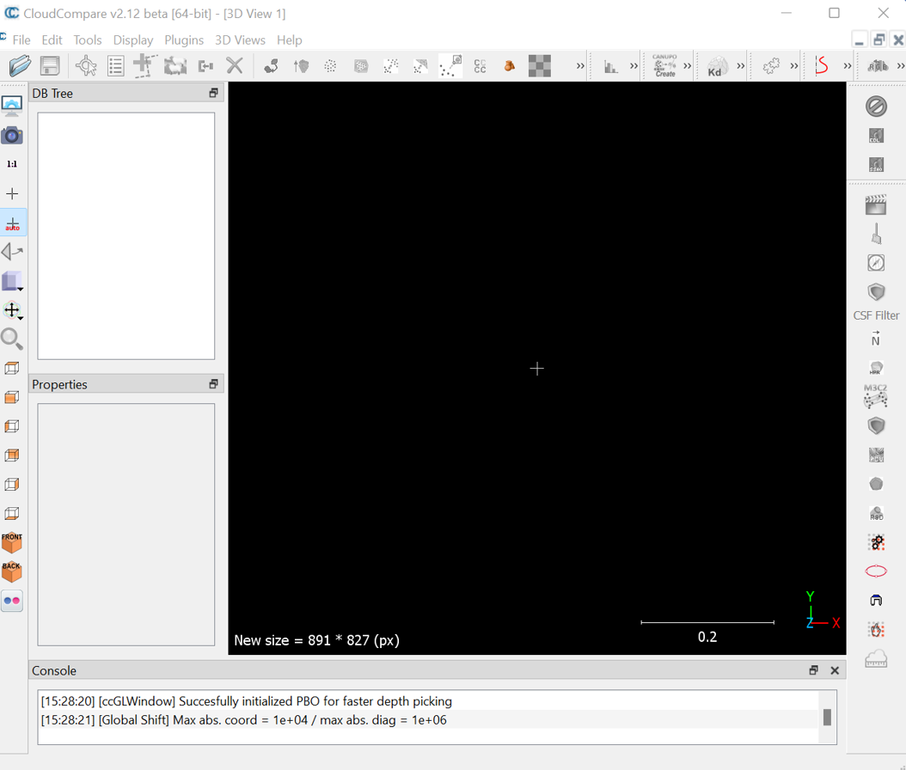
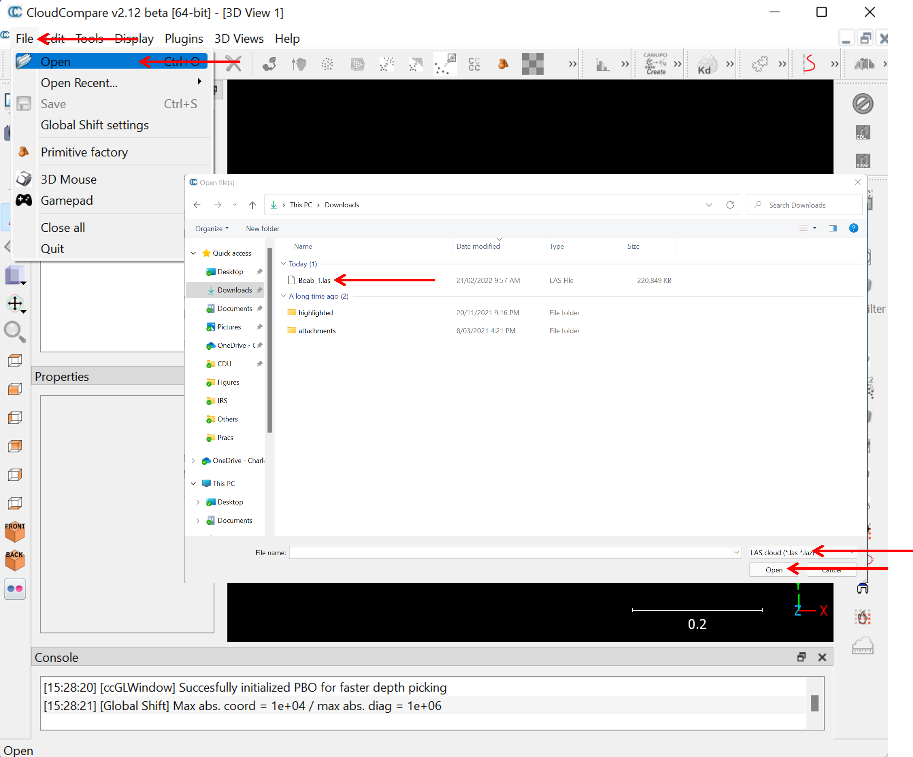

# Introductory Remote Sensing (ENV202/502)
Prac 9 - Working with Terrestrial Laser Scanning (TLS) data in CloudCompare

### Acknowledgments 
- 

### Prerequisites

Completion of this Prac exercise requires use of the CloudCompare software package. CloudCompare is a powerful package for visualising and processing point-clouds, and best of all is open-access. You can download the version to match your operating system. [Download here](https://www.danielgm.net/cc/)

### Objective
The objective of this Prac is to familiarise yourself with 3D point cloud data. We will use data that we collected last week on campus in the Boab court. 

---------------------------------------------------

## 1. Downloading the data.
1. We collected multiple scans with a Leica BLK360 laser scanner at Boab court in front of the Mal Narin Auditorium, and we will work with two of these scans today.

2. The Scan data is coverted from native BLK360 format to a .las format. In the link below you can downoad the .las format which can be read by the CloudCompare (please note that each file is ~ 200 MB):

- [Scan 1](https://charlesdarwinuni-my.sharepoint.com/:u:/g/personal/deepak_gautam_cdu_edu_au/EQLh_JE920JLp_blNIwjTKsBiGV8vVQzt1FMhq6hNhOvAw?e=6X6zBP) | [Scan 2](https://charlesdarwinuni-my.sharepoint.com/:u:/g/personal/deepak_gautam_cdu_edu_au/ERJnGoCYMHVAi85v6DKOWMIB5e4ydWOG5zyEwNVHqeTEFQ?e=4q7Ar5)

## 2. Getting to know CloudCompare

1. Launch the CloudCompare application. Note that your interface might look a bit different depending on if you are in Windows or Machintos machine - but don't worry the tools and menus are consistent across platforms. In this Prac, I have used a Windows 11 machine with CloudCompare V2.1 64 bit. 

2. Thats your cloud compare window. Here we will now import the scans one at a time. Open up the first scan by clicking File>Open, navigate to where you downloaded/saved the data, select the extension to LAS cloud (*.las, *.laz), click on Boab_1.las, and then click open.

4. This will prompt a window asking if you would like to apply default settings - click Apply

5. Another window will appear asking you about coordinate transformations - click Yes

6. A progress bar should appear showing you how many points are being ingested (6.6 million in this case) and then the point cloud should render in the main viewing window as shown below.

7. The top-left panel houses the file structure. Click on Baob_1.las and you will see some information appear in the panel below it, and the spatial extent of the file will be highlighted in the main window. In the properties panel (lower left) we can see that the current display options are set to RGB (the Leica BLK360 captures true-colour images in addition to laser data) and that there are 6,651,421 points in this cloud. 

8. Let's zoom in a bit closer to see more detail. Hold your mouse over the main viewing window and use the scroll wheel to zoom in and out.

9. As you can see, we are looking down on our scan from above - a bird's eye perspective. The green lawn is clearly visible, and the circular gap in the centre is where the scanner was placed (the scanner does not scan directly beneath itself). See what other features you can identify - the boab trees, building, sun-shades etc.

10. Although this aerial view is interesting, we currently have a 2D view. The reason we use LiDAR is for a 3D perspective - so use your LEFT mouse button to click and tilt the scene. Your RIGHT mouse button will pan the image (up, down, left, right) and the SCROLL WHEEL is for zooming in and out.

11. The 3D navigation takes a while to get used to. Play around a bit to get the hang of it - and try navigate to the view shown below. You can see your fellow students waiting in the shade on the steps of the Mal Nairn Auditorium.

12. If at some stage you get lost in the scene, you can use the 1:1 button to return to an aerial view of the full spatial extent. And then you can also click on custom views such as the top will get you to the original view you had at the start of this prac. 

13. So far we have been visualising the TLS data in RGB - that is the reflectance values recored by the camera are being given to each point. We see some issue with this in the tips of tree branches whereby the blue colour of the sky is given to the thin branches of the boab trees. This is partly due to the camera resolution being coarser than the laser resolution.

14. Since the TLS is recording distance to objects in x,y and z coordinates, we can also visualise the cloud in terms of elevation. With the file selected in the top-left panel, click Edit>Colours>Height ramp from the main menu. A new window will appear where you can apply a colour scale to the elevation data. Use the default options and click OK

16. The point cloud will now be rendered with a default colour scale showing lower elevation points in blue, taller points in green, and the tallest in red.

17. Zoom in a bit to see the effect in 3D.

18. To create a more 3D textured look we can use a light shader. Using the main menu navigate to
Display>Shaders & filters and turn on the E.D.L shader.

19. This results in a visualisation with more depth/texture.

## 3.  Merging multiple point clouds
2. Now lets add our second scan and merge the two pointclouds. You can close the current CloudCompare window and import two scans together or you can add the second scan to the exisiting first scan. In below example I have restarted the CloudCompare application and imported both scans at the same time. In any case, you need to go to File>Open, and navigate to where the scan data is stored/downloaded and select Boab_2.las (or Both Boab_1.las and Boad_2.las). If you cannot see your files or they are greyed out, make sure you have the file type set to ".las" or "All".

3. Similar to the previous section, apply all the default settings and click Yes to the coordinate transformations. Once the two files have loaded, you will see that they are not correctly aligned. The pointcloud looks messy.

5. In fact, if you zoom in closer (using the mouse wheel), you will see that the two scans are positioned exactly on top of each other even though they were collected ~ 10m apart.

6. This issues occurs because the scans are in the scanners own coordinated system (SOC) and not in a geographic coordinate system (the BLK360 lacks a GPS). The origin of both scans is 0,0,0 (x,y,z) - every point is relative to the scanner itself.

7. We will align these two scans using a combination of manual translation (rough positioning) and an automated computer algorithm called Iterative Closest Point (ICP) for fine tuning.

8. Before starting with this, let us map both clouds according to an elevation colour scale (height ramp) - using the default scale for blue to green to red. Be sure to select both clouds before applying the colour ramp.

9. Next select only the Boab_2.las file, and choose the "Translate" tool from either the main Menu or from the icon in the toolbar. Here we want to translate (move) the Boab_2 scan while having the Boab_1 fixed.

10. You will see a new toolbar appear in the top-right corner of the main window, and small white text in the top-centre of the main window will remind you that the tool is active.

11. Before going any further we will change the rotation axis from xyz to z only in the translation dialogue window. This will ensure that the point cloud (Boab_2) can only be rotated around the z axis preventing any unwanted tilting. Also disable the Tz this will mean that  only left/right up/down translation are possible preventing any unwanted height offset between the scans.

12. Now we can use the right-mouse click to drag the selected cloud (Boab_2) in any direction we like - in the screenshot below you will see I have shifted the BOab_2 scan over to the right.

13. Now we can see the two scans clearly, and we can see that Boab_2 needs to be rotated clockwise to align better with Boab_1. Using the left mouse button click and drag the Boab_3 cloud to rotate it by about 30 degrees in the clockwise direction to approximately align the two scans (see example below). 

14. Now that the rotation looks better, we can use the right-mouse button to pull the Boab_2 point cloud over to the left again and position it in better alignment with Boab_1.

15. That looks much better, I can see the trees are aligned and the two scan position are about where we did the scan. You can now click the green tick to accept these changes to the orientation matrix of Boab_2.

16. The transformation has been applied. Now, zoom in and check the 3D pointcloud. If we examine some straight lines for example, it is still clear that some minor offset is present in the two scans. In below example, I have zoomed to Boab tree and can see minor offset in their stem position.  

17. You can try translating the pointcloud again to get a better alignment. However, you will find that it is impossible to perfectly line up the pointcloud every last little branch. Trees will sway in the breeze and the scanner might not be set up perfectly horizontally (**Question***How does knowing the pitfalls of data processing affect your decision about when to scan (e.g. season/ time of day)?*). Once you have a fairly aligned pointclouds, – the ICP tool can fine tune the alignment for us. Lets correct this minor offset using the ICP algorithm. 

18. Make sure both the scans are selected before going for ICP. Next select "Fine Registration (ICP)" tool from either the main Menu or from the icon in the toolbar. 

19. Lets put the Boab_1 scan as the reference and Boab_2 as aligned. So this means the Boab_2 pointcloud will be moved to match with Boab_1. Change the final overlap to 30% and click ok for the ICP to be applied. 

20. Once the ICP coregistration is complete, you will get a registration information. You can click Ok.

21. Now zoom in to check the details. In below example, I have zoomed in to the same tree where I noticed offset earlier. The tree seems to be represented better here. The ICP has done the final fine tuning of the pointcloud alignment for us.   

22. After the alignment/registration, most of the occlusion seems to have been resolved. For instance, on a single scan, you could see plenty of occlusion while in the two aligned scans, you can see less occlusion, whilst some occlusion are still present towards the edge of the scans. Do you know how you could resolve those occlusions towards the edge?

23. Dont forget to save your work. 
  

-------
### Thank you

I hope you found this prac useful. This prac does not include any scripting, hence there will be no recorded video of this prac. You should be able to follow the Prac using the detailed steps presented to you. 

#### Kind regards, Shaun R Levick (edit Deepak Gautam)
------
### The end