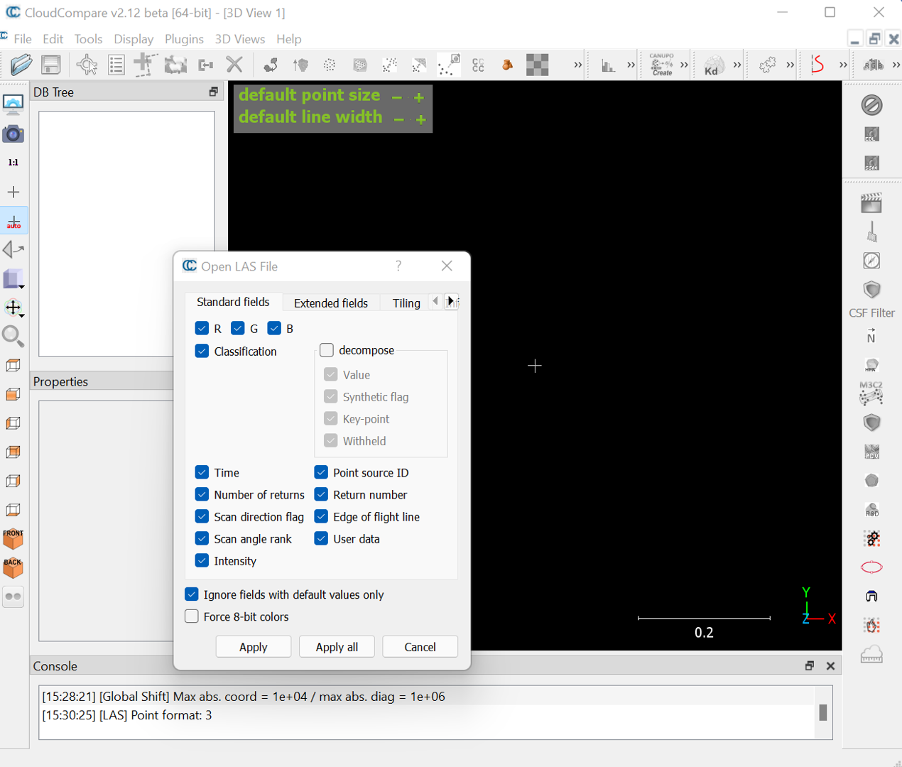
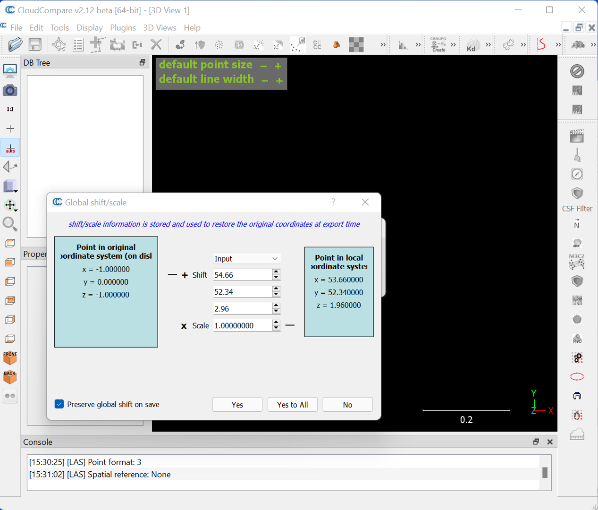

# Introductory Remote Sensing (ENV202/502)
Prac 9 - Working with Terrestrial Laser Scanning (TLS) data in CloudCompare - Part I

### Acknowledgments 
- Dr Shaun Levick

### Prerequisites

Completion of this Prac exercise requires the use of the CloudCompare software package. CloudCompare is a powerful package for visualising and processing pointclouds, and best of all is open-access. You can download the version to match your operating system. [Download CloudCompare here](https://www.danielgm.net/cc/)

### Objective
The objective of this Prac is to familiarise yourself with 3D pointcloud data. We will use data that we collected last week on campus in the Boab court to learn basic navigation and visualisation of laser scanning data in the CloudCompare. 

---------------------------------------------------

## 1. Downloading the data.
1. We collected multiple scans with a Leica BLK360 laser scanner at Boab court in front of the Mal Narin Auditorium, and we will work with two of these scans today.

2. The Scan data is converted from native BLK360 format to a .las format. In the link below you can download the .las format which can be read by the CloudCompare (please note that each file is ~ 200 MB):

- [Scan 1](https://charlesdarwinuni-my.sharepoint.com/:u:/g/personal/deepak_gautam_cdu_edu_au/EQLh_JE920JLp_blNIwjTKsBiGV8vVQzt1FMhq6hNhOvAw?e=6X6zBP) | [Scan 2](https://charlesdarwinuni-my.sharepoint.com/:u:/g/personal/deepak_gautam_cdu_edu_au/ERJnGoCYMHVAi85v6DKOWMIB5e4ydWOG5zyEwNVHqeTEFQ?e=4q7Ar5) For this prac, download the Scan 1.

## 2. Getting to know CloudCompare

1. Launch the CloudCompare application. Note that your interface might look a bit different depending on if you are on Windows or Macintosh machine - but don't worry the tools and menus are consistent across platforms. In this Prac, I have used a Windows 11 machine with CloudCompare V2.1 64 bit. 

2. That's your CloudCompare window. Here we will now import the scans one at a time. Open up the first scan by clicking File>Open, navigate to where you downloaded/saved the data, select the extension to LAS cloud (*.las, *.laz), click on Boab_1.las, and then click open.

3. This will prompt a window asking if you would like to apply default settings - click Apply

4. Another window will appear asking you about coordinate transformations - click Yes

5. A progress bar should appear showing you how many points are being ingested (6.6 million in this case) and then the pointcloud should render in the main viewing window as shown below.

6. The top-left panel houses the file structure. Click on Baob_1.las and you will see some information appear in the panel below it, and the spatial extent of the file will be highlighted in the main window. In the properties panel (lower left) we can see that the current display options are set to RGB (the Leica BLK360 captures true-colour images in addition to laser data) and that there are 6,651,421 points in this cloud. 

7. Let's zoom in a bit closer to see more detail. Hold your mouse over the main viewing window and use the scroll wheel to zoom in and out.

8. As you can see, we are looking down on our scan from above - a bird's eye perspective. The green lawn is clearly visible, and the circular gap in the centre is where the scanner was placed (the scanner does not scan directly beneath itself). See what other features you can identify - the boab trees, buildings, sun-shades etc.

9. Although this aerial view is interesting, we currently have a 2D view. The reason we use LiDAR is for a 3D perspective - so use your LEFT mouse button to click and tilt the scene. Your RIGHT mouse button will pan the image (up, down, left, right) and the SCROLL WHEEL is for zooming in and out.

10. The 3D navigation takes a while to get used to. Play around a bit to get the hang of it - and try to navigate to the view shown below. You can see your fellow students waiting in the shade on the steps of the Mal Nairn Auditorium.

11. If at some stage you get lost in the scene, you can use the 1:1 button to return to an aerial view of the full spatial extent. And then you can also click on custom views such as the top will get you to the original view you had at the start of this prac. 

12. So far we have been visualising the TLS data in RGB - that is the reflectance values recorded by the camera are being given to each point. We see some issue with this in the tips of tree branches whereby the blue colour of the sky is given to the thin branches of the boab trees. This is partly due to the camera resolution being coarser than the laser resolution.

13. Since the TLS is recording distance to objects in x,y and z coordinates, we can also visualise the cloud in terms of elevation. With the file selected in the top-left panel, click Edit>Colours>Height ramp from the main menu. A new window will appear where you can apply a colour scale to the elevation data. Use the default options and click OK

14. The pointcloud will now be rendered with a default colour scale showing lower elevation points in blue, taller points in green, and the tallest in red.

15. Zoom in a bit to see the effect in 3D.

16. To create a more 3D textured look we can use a light shader. Using the main menu navigate to
Display>Shaders & filters and turn on the E.D.L shader.

17. This results in visualisation with more depth/texture.

18. Explore the pointcloud to look for 3D details think about how you can use this data. How would you remove the occlusion? Don't forget to save your work. 
 
## 3. Exercise for you. 
1.	Download the second scan data (Boab_2.las)
2.	Repeat the above steps for the second scan. 
3.	What differences do you notice between the first and second scans?

-------
### Thank you

I hope you found this prac useful. This prac does not include any scripting, hence there will be no recorded video of this prac. You should be able to follow the Prac using the detailed steps presented to you. 

#### Kind regards, Deepak Gautam
------
### The end
