# Introductory Remote Sensing (ENV202/502)
Prac 10 - Working with Terrestrial Laser Scanning (TLS) data in CloudCompare - Part II

### Acknowledgments 
- Dr Shaun Levick
- Linda Luck

### Prerequisites

Completion of this Prac exercise requires the use of the CloudCompare software package. CloudCompare is a powerful package for visualising and processing pointclouds, and best of all is open-access. You can download the version to match your operating system. [Download here](https://www.danielgm.net/cc/)

### Objective
The objective of this Prac is to familiarise yourself with 3D pointcloud data. We will use data that we collected last week on campus in the Boab court to learn the scan alignment and registration using CloudCompare. 

---------------------------------------------------

## 1. Downloading the data.
1. We collected multiple scans with a Leica BLK360 laser scanner at Boab court in front of the Mal Narin Auditorium, and we will work with two of these scans today.

2. The Scan data is converted from native BLK360 format to a .las format. In the link below you can download the .las format which can be read by the CloudCompare (please note that each file is ~ 200 MB):

- [Scan 1](https://charlesdarwinuni-my.sharepoint.com/:u:/g/personal/deepak_gautam_cdu_edu_au/EQLh_JE920JLp_blNIwjTKsBiGV8vVQzt1FMhq6hNhOvAw?e=6X6zBP) | [Scan 2](https://charlesdarwinuni-my.sharepoint.com/:u:/g/personal/deepak_gautam_cdu_edu_au/ERJnGoCYMHVAi85v6DKOWMIB5e4ydWOG5zyEwNVHqeTEFQ?e=4q7Ar5)

## 2. Importing the two scans

1. Launch the CloudCompare application. Import two scans together - go to File>Open, navigate to where you downloaded/saved the data, select the extension to LAS cloud (*.las, *.laz), select both Boab_1.las and Boab_2.las, and then click open.

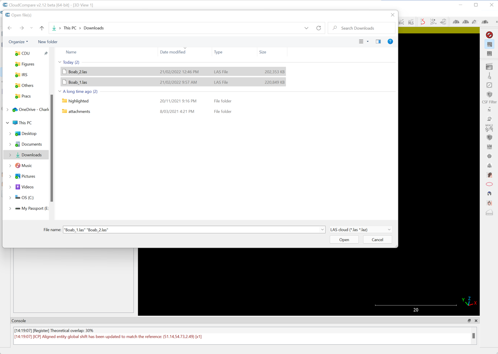

2. Similar to the previous section, apply all the default settings and click Yes to the coordinate transformations. Once the two files have loaded, you will see that they are not correctly aligned. The pointcloud looks messy.

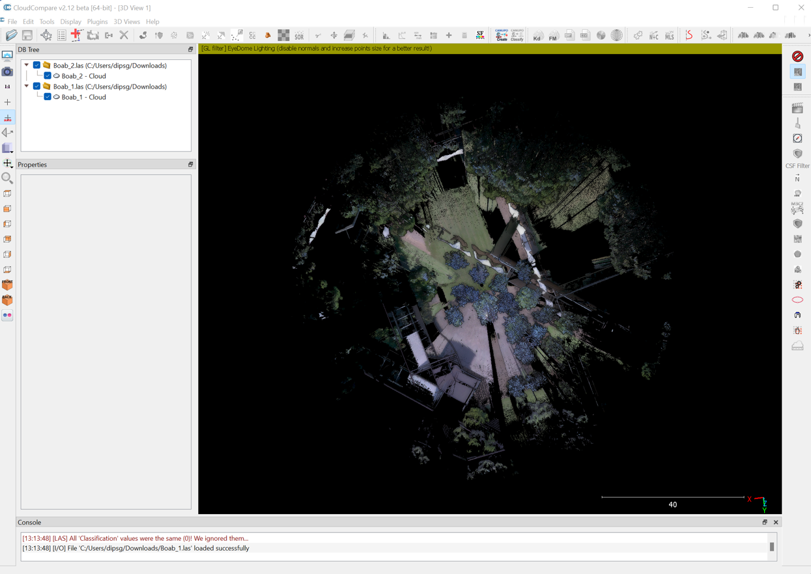

3. In fact, if you zoom in closer (using the mouse wheel), you will see that the two scans are positioned exactly on top of each other even though they were collected ~ 10m apart.

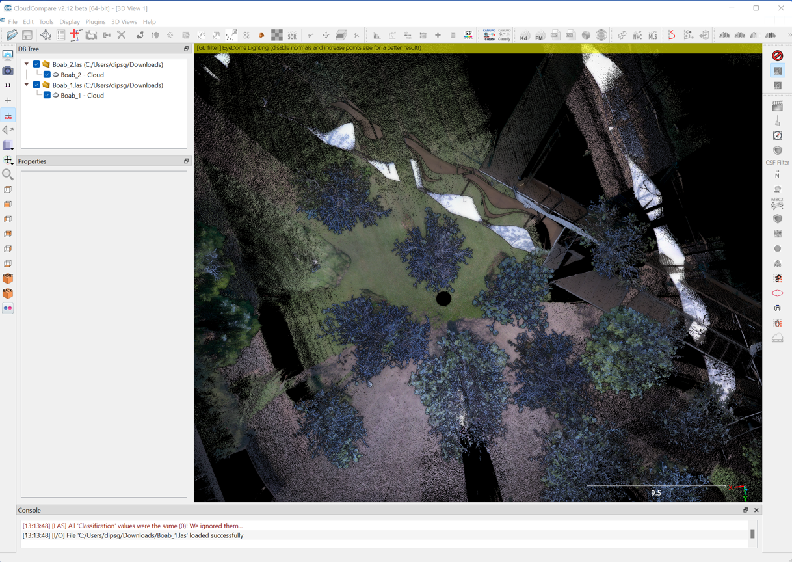

4. This issue occurs because the scans are in the scanners own coordinated system (SOC) and not in a geographic coordinate system (the BLK360 lacks a GPS). The origin of both scans is 0,0,0 (x,y,z) - every point is relative to the scanner itself.

5. We will align these two scans using a combination of manual translation (rough positioning) and an automated computer algorithm called Iterative Closest Point (ICP) for fine-tuning.

6. Before starting with this, let us map both clouds according to an elevation colour scale (height ramp) - using the default scale for blue to green to red. Be sure to select both clouds before applying the colour ramp.

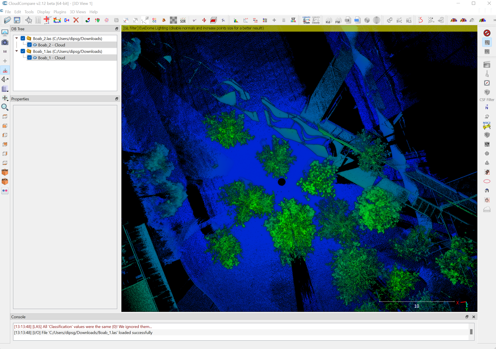

7. Next select only the Boab_2.las file, and choose the "Translate" tool from either the Main Menu or from the icon in the toolbar. Here we want to translate (move) the Boab_2 scan while having the Boab_1 fixed.

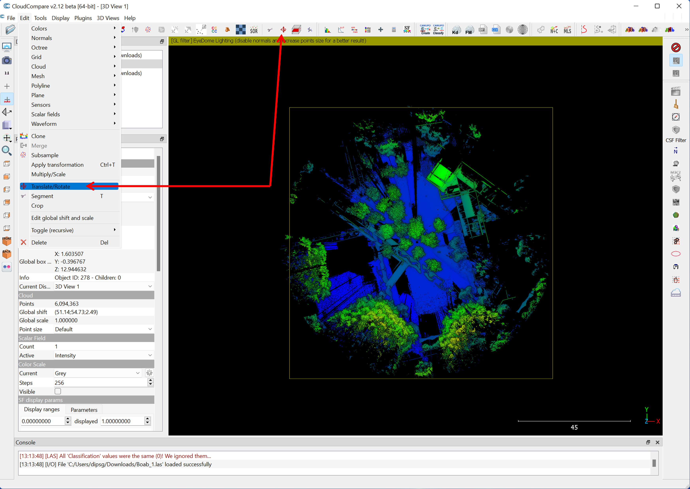

8. You will see a new toolbar appear in the top-right corner of the main window, and small white text in the top-centre of the main window will remind you that the tool is active.

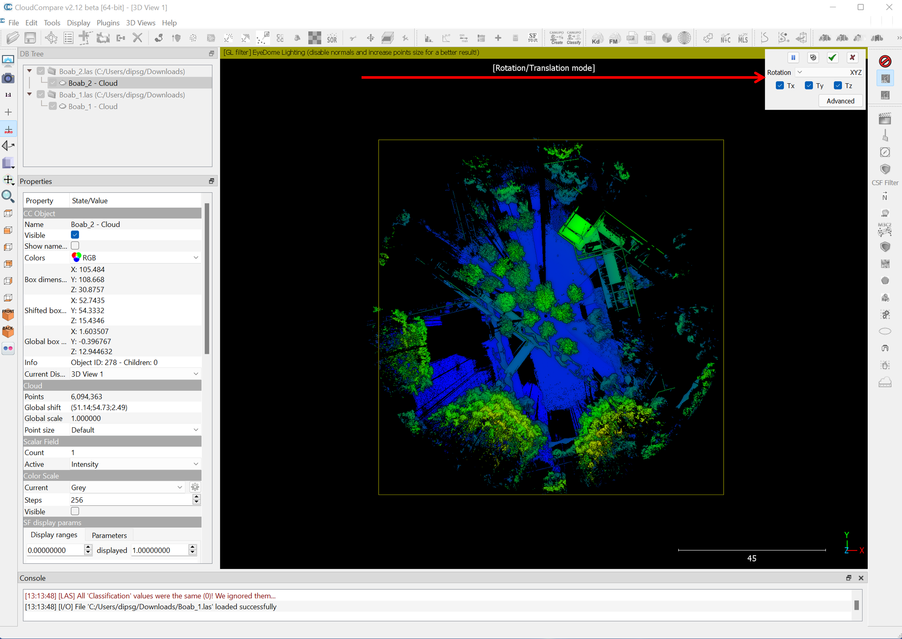

9. Before going any further we will change the rotation axis from xyz to z only in the translation dialogue window. This will ensure that the pointcloud (Boab_2) can only be rotated around the z-axis preventing any unwanted tilting. Also, untick the Tz translation, this will mean that only left/right up/down translations are possible preventing any unwanted height offset between the scans.

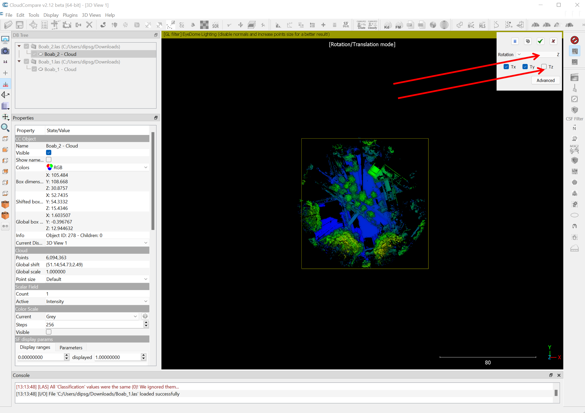

10. Now we can use the right-mouse click to drag the selected cloud (Boab_2) in any direction we like - in the screenshot below you will see I have shifted the Boab_2 scan over to the right.

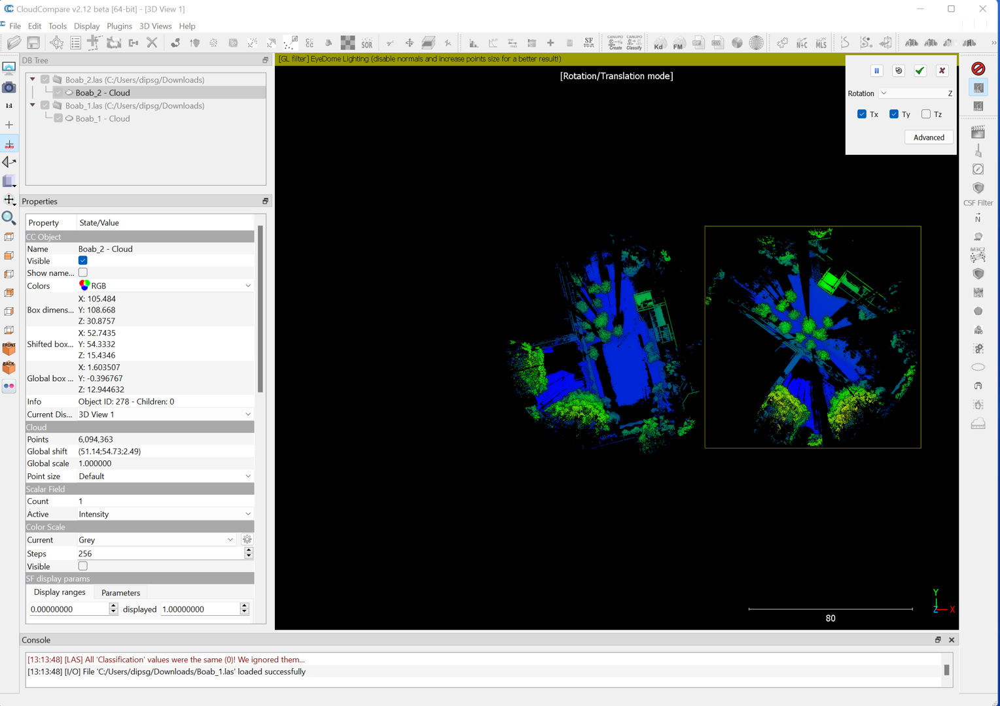

11. Now we can see the two scans clearly, and we can see that Boab_2 needs to be rotated clockwise to align better with Boab_1. Using the left mouse button click and drag the Boab_3 cloud to rotate it by about 30 degrees in the clockwise direction to approximately align the two scans (see example below). 

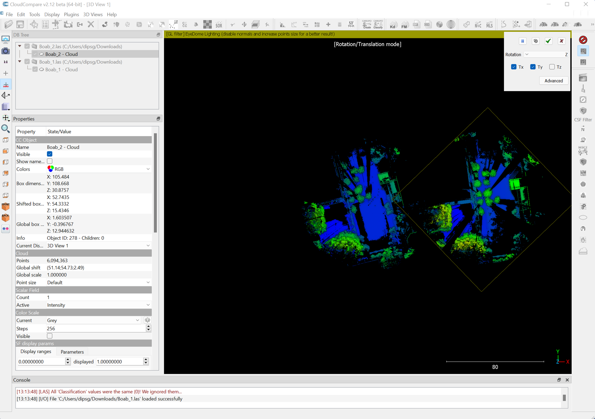

12. Now that the rotation looks better, we can use the right mouse button to pull the Boab_2 pointcloud over to the left again and position it in better alignment with Boab_1.

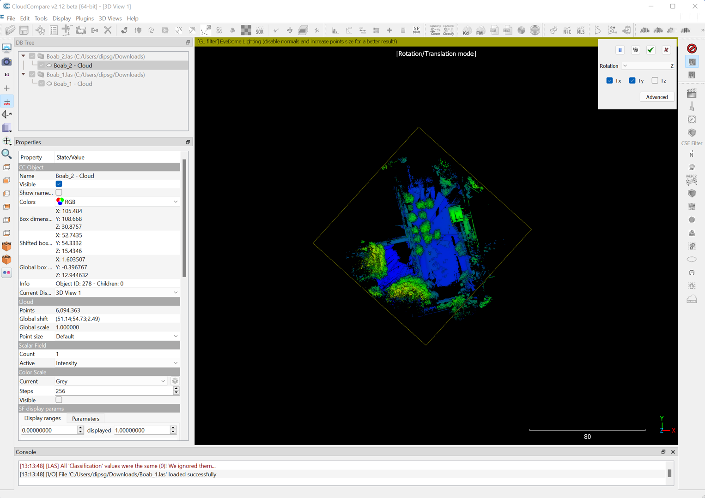

13. That looks much better, I can see the trees are aligned and the two scan positions are about where we did the scan. You can now click the green tick to accept these changes to the orientation matrix of Boab_2.

14. The transformation has been applied. Now, zoom in and check the 3D pointcloud. If we examine some straight lines, for example, it is still clear that some minor offset is present in the two scans. In the below example, I have zoomed to the Boab tree and can see a minor offset in their stem position.  

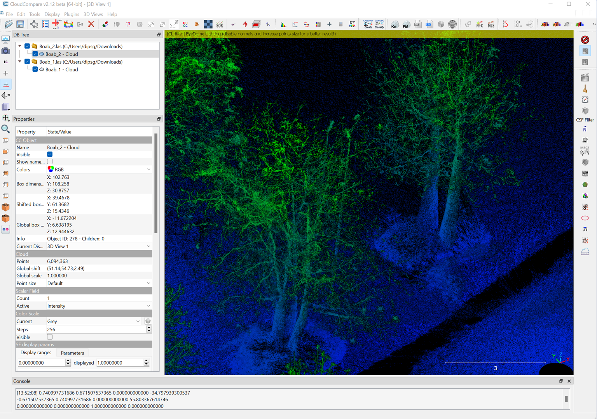

15. You can try translating the pointcloud again to get a better alignment. However, you will find that it is impossible to perfectly line up the pointcloud every last little branch. Trees will sway in the breeze and the scanner might not be set up perfectly horizontally (**Question***How does knowing the pitfalls of data processing affect your decision about when to scan (e.g. season/ time of day)?*). Once you have a fairly aligned pointclouds, – the ICP tool can fine-tune the alignment for us. Let us correct this minor offset using the ICP algorithm. 

16. Make sure both the scans are selected before going for ICP. Next, select the "Fine Registration (ICP)" tool from either the Main Menu or from the icon in the toolbar. 

17. Let's put the Boab_1 scan as the reference and Boab_2 as aligned. So this means the Boab_2 pointcloud will be moved to match with Boab_1. Change the final overlap to 30% and click ok for the ICP to be applied. 

18. Once the ICP coregistration is complete, you will get registration information. You can click Ok.

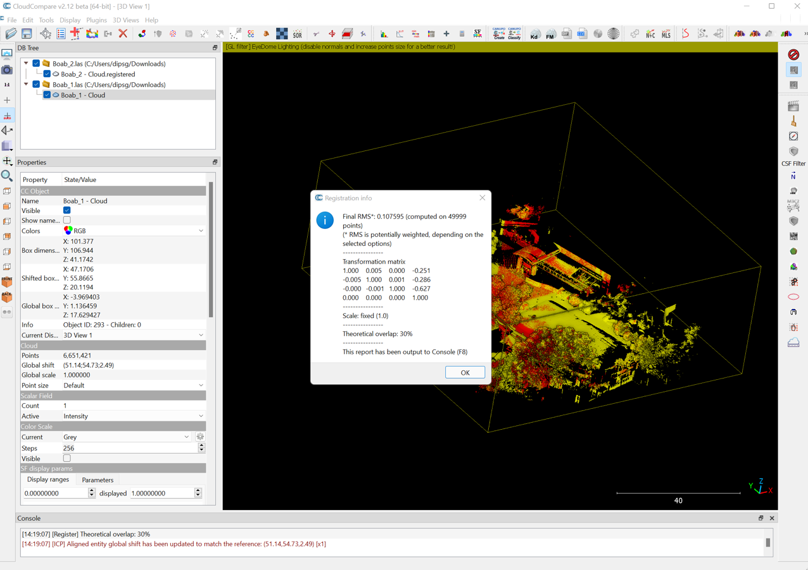

19. Now zoom in to check the details. In the below example, I have zoomed in to the same tree where I noticed offset earlier. The tree seems to be represented better here. The ICP has done the final fine-tuning of the pointcloud alignment for us.   

20. After the alignment/registration, most of the occlusion seems to have been resolved. For instance, on a single scan, you could see plenty of occlusions while in the two aligned scans, you can see less occlusion, whilst some occlusions are still present towards the edge of the scans. Do you know how you could resolve those occlusions towards the edge? Don't forget to save your work. 
  

-------
### Thank you

I hope you found this prac useful. This prac does not include any scripting, hence there will be no recorded video of this prac. You should be able to follow the Prac using the detailed steps presented to you. 

#### Kind regards, Deepak Gautam
------
### The end
