# Introductory Remote Sensing (ENV202/502)
Prac 11 - Drone remote sensing


### Acknowledgments 

- Wine Australia and University of Adelaide.
- Data from [this publication](https://www.mdpi.com/2072-4292/13/13/2639/htm)

### Objective

In todays prac, we will quickly look into drone remote sensing examples. You will learn how transferrable your skills from the satellite remote sensing are to the drone remote sensing.

---------------------------------------------------
## 1. How did the drone data get into the Google Earth Engine?
1. Well Google Earth Engine dont normally subscribe to drone imagery. However, as a user, you can always upload your data to GEE. Click on the Assets tab to see if you have some Google Earth Engine assets. Your assets could be raster/vector images or shapefiles. You can see that I have 1 raster and several shapefile living in my Assets. 
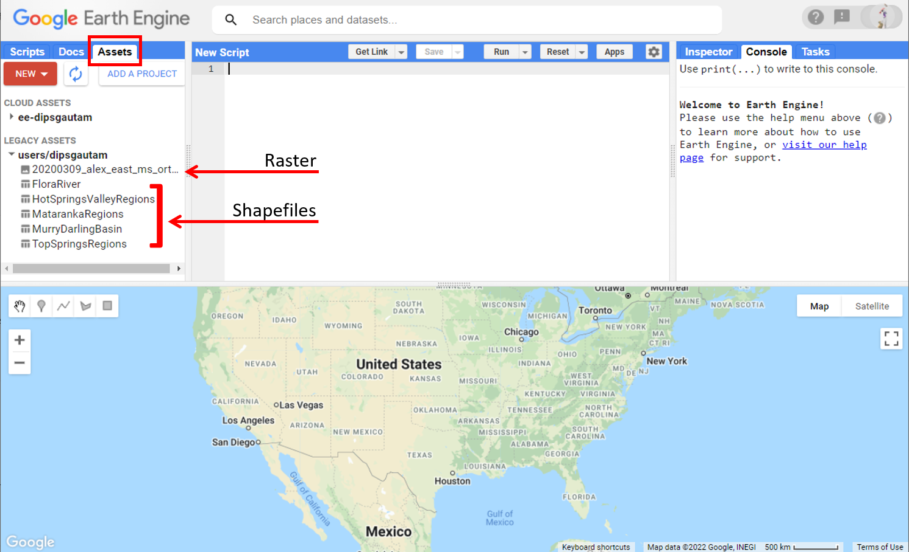

2. To add your own data, you can always click on New button and then select the relevant option and follow through. The google earth engine will then ingest the data. 
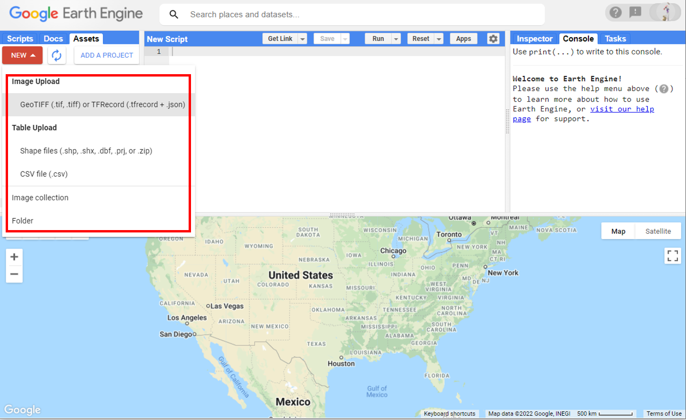

3. Once the data is ingested, you can share the data with anyone you like by adding their email or domain or make the data publicly available by clicking on the "anyone can read" button. 

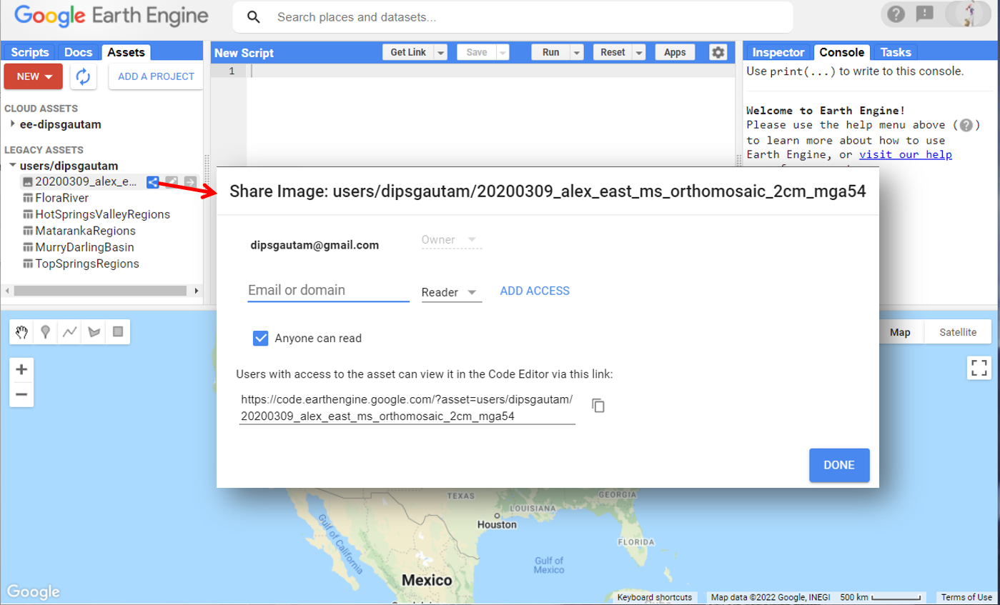

4. You dont need to repeat the above steps or follow them. You just need to know how to put your own data in GEE which may be handy for your future projects and collaborations. For instance, I follow these steps when working with students in their honours/PhD projects. 

## 2. Importing and visualisation of the image
1. Use the below script to import the drone data into your coding environment.
```JavaScript
// Import the UAV image into your coding environment.
var UAVImage = ee.Image("users/dipsgautam/20200309_alex_east_ms_orthomosaic_2cm_mga54");
```

2. First lets learn abou the dataset. This dataset is over a Cabernet Sauvignon vineyard in Coonawarra region of South Australia. The name of the file "20200309_alex_east_ms_orthomosaic_2cm_mga54" has a lot of information. This data was acquired at 9th of March 2020 over a vineyard called Alex at the eastern end. It is a multispectral image at 2 cm spatial resolution in MGA 54 coordinate system. Early march for the Cabernet Sauvignon in Coonawarra corresponds to the the post-veraison phenology stage of the grapevine. This is when the berris have completly turned purple and are ripening and accumulating sugars. The accumulation of sugars is depends on the level of leaf photosynthesis which further can be restricted by abiotic stress in the plant. So, for higher quality of wine, it is necessary that plants photosynthetic activities are at optimal level and plants are healthy. Its a very complex topic but thats the summary you might find useful. 

3. To access the photosynthetic activities and health of plant, I have acquired multispectral and thermal imagery of the grapevine (thermal is not included here). In this exercise, we will do simple analysis using NDVI to access the canopy-specific assessment of photosynthesis and plant health. 

4. The multispectral data was collected using one of the multispectral camera called [MicaSense RedEdge-MX](https://micasense.com/rededge-mx/). You can have a read about the sensor specification and think about the bands that this sensor can collect. Below is the image showing the bands that this sensor collects. 

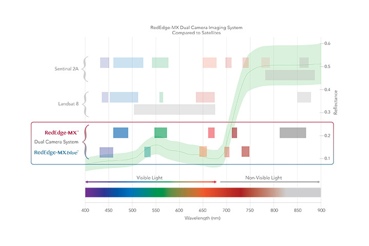 

5. Now, try printing the information of the "UAVImage" to see the band information.
```JavaScript
// print the information of the UAVImage
print(UAVImage);
```

6. The image has 6 bands named "b1" (blue), "b2" (green), "B3" (red), "b4"(red-edge), "b4"(near infrared), "b6" (alpha band - ignore). Now, display the true color composite of the image. You know how to do it. 

```JavaScript
// display the true color composite
Map.addLayer(UAVimage,{bands:['b3','b2','b1'],min:5000,max:40000},"UAV Image True color");
```

7. The image has been displayed but we dont kow where in the world the image is. Add following lines below so when the image is displayed, your map automatically pans over to the image. 
```JavaScript
// always centre the map to the UAVImage location
Map.centerObject(UAVImage);
```
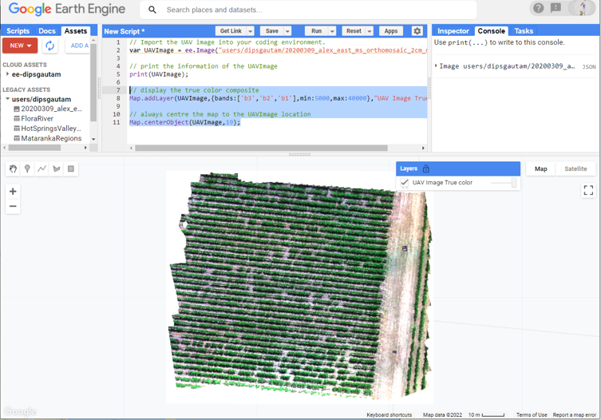 

8. The amount of detail you can see in this image is quite amazing. You can see individual shoots of the vine, the shadows of the canopy, the stem, several GCPs (whats GCPs - recall from lecture?), and four calibration panels. Zoom in pan over, enable the satellite view and explore the Coonawarra region. 

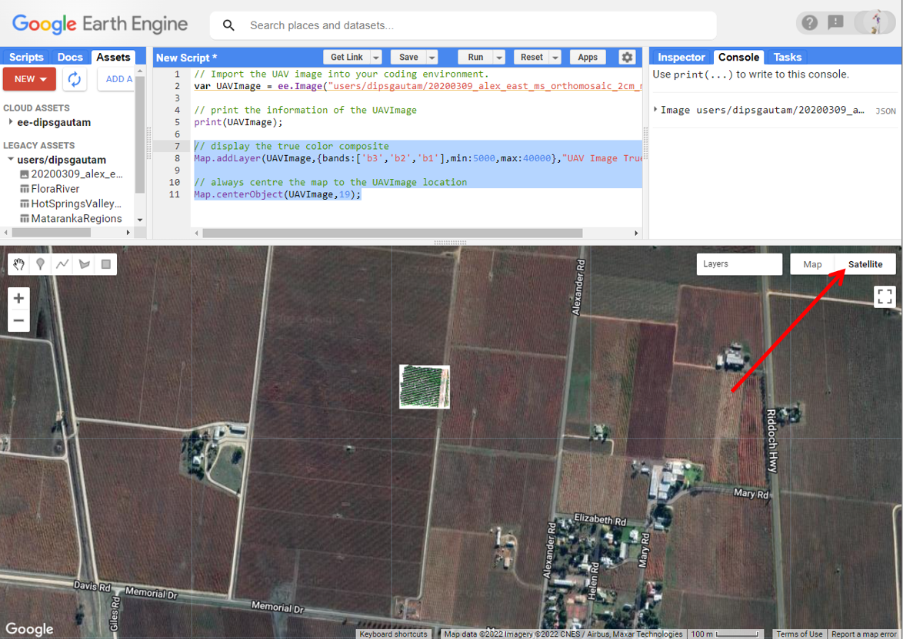

9. Now lets also display the false-color composite which highlights the photosynthetically active vegetation. 

```JavaScript
//display the false color composite
Map.addLayer(UAVImage,{bands:['b5','b3','b2'],min:5000,max:40000},"UAV Image False color");
```

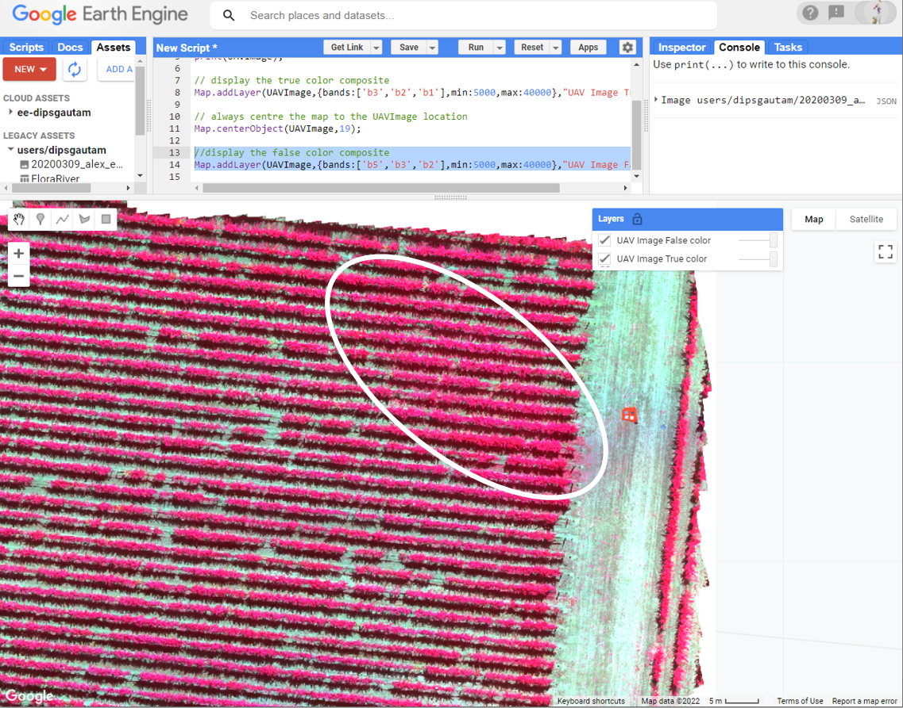

10. The false color highlights the photosynthetically active vegetation in bright pink color. You can see that the entire vineyard is bright pink. The north-eastern end has more pink pixels indicating the dense canopies. Also notice the heavy under-canopy vegetation at that location. This was the area where there was leakage in irrigation water. Due to this the vines at this location were highly vigorous as well as inter-row vegetation was present. 

## 3. Computation of NDVI
1. Can you recall the script we used to compute the NDVI for Landsat images and modify that to calculate NDVI for this image? This should be not too difficult for you at this point. Use below script to compute and add the NDVI map to the GEE. 

```JavaScript
//Define variable NDVI from equation
var ndviImage = UAVImage.expression(
  "(NIR - RED) / (NIR + RED)",
  {
    RED: UAVImage.select("b3"),    //  b3 is the RED band
    NIR: UAVImage.select("b5")    // b5 is the NIR band
  });

// Add the NDVI image to the map, using the visualization parameters.
Map.addLayer(ndviImage, {min: 0, max: 1, palette: ['red','yellow','green','darkgreen']}, "NDVI");
```

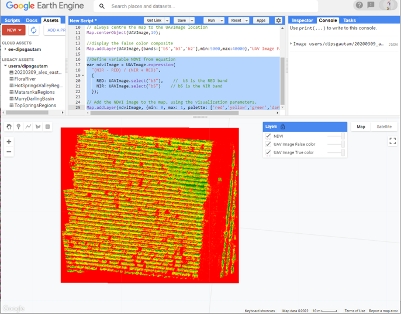

2. The low NDVI (baresoil) is presented in red color, the low NDVI (unhealthy canopy and the shadow) is presented in yellow color while the healthy canopy is shown in green and darkgreen color. Not the best looking NDVI image - we can do better. What we are really interested here is the canopy pixels and dont care much about the non-canopy pixels. So, we can mask the image using NDVI threshold and display the masked NDVI. 

```JavaScript
// Mask out all the pixels that have ndvi value  lower than 0.4
var maskedNDVIImage = ndviImage.updateMask(ndviImage.gt(0.4));
// Add the maskedNDVIImage to the map, using the visualization parameters.
Map.addLayer(maskedNDVIImage, {min: 0.4, max: 1, palette: ['yellow','green','darkgreen']}, "masked NDVI");
```
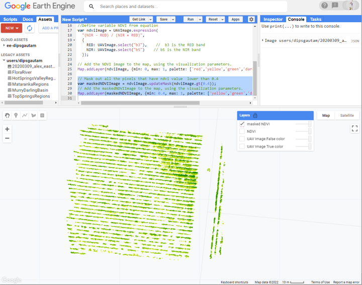

## 5. Extract canopy-specific NDVI value
1. Disable all the layers except for the true color. Zoom in to maximum extent and find a vine that looks healthy to you. Now use the rectangular polygon tool to draw approximately 2x2 m polygon. Hint- use the map scale as a reference. We are dwaring approximately 2x2 m polygon because we know the approximate vine length is 2 m. 

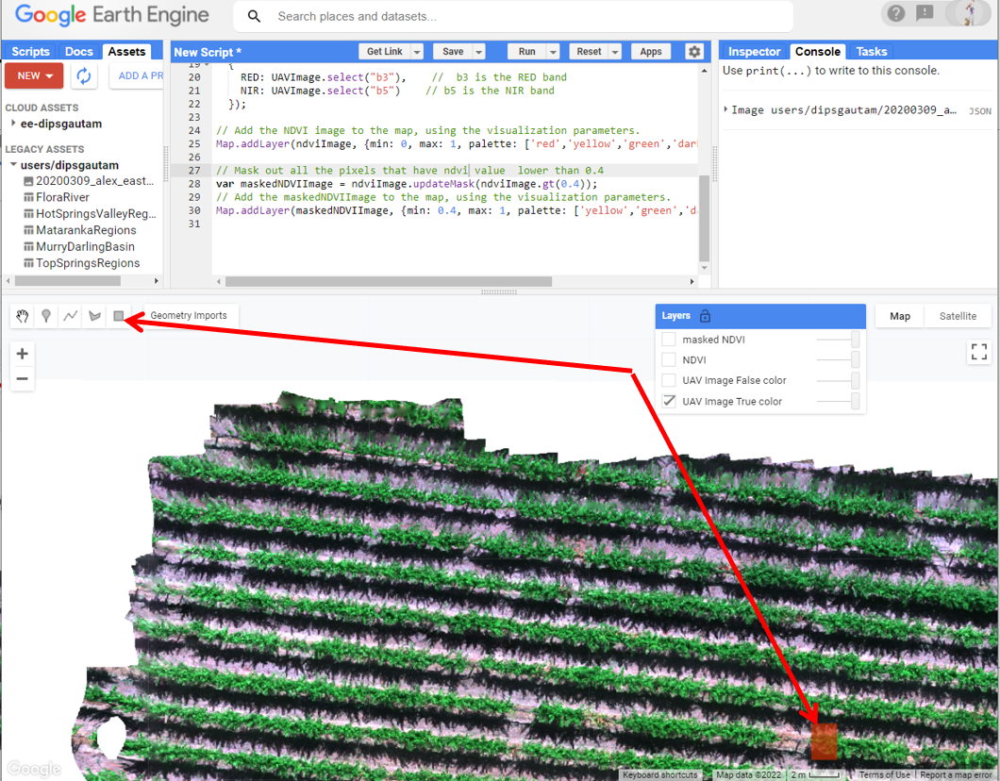

2. Now look for a vine that you think is unhealthy and add a new geometry sized 2x2 meter. Rename the two geometries to "healthyVine" and "stressedVine"

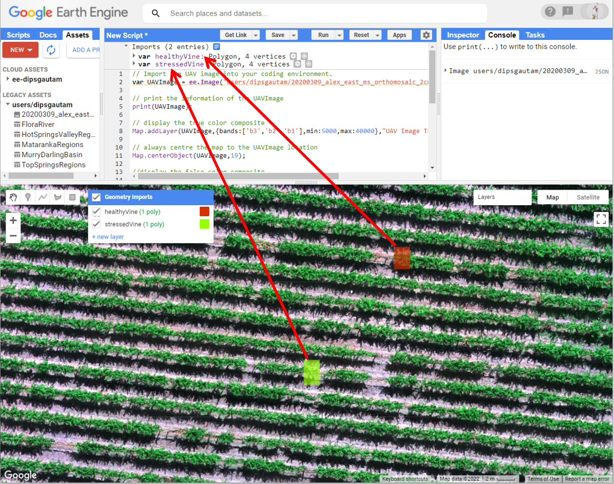

3. Now we have the bounding box for the healthy and unhealthy vine, use the maskedNDVIImage layer to extract the NDVI value from the two vines. 

```JavaScript
// Apply spatial reducer to extract mean NDVI for the healthy vine
var healthyNDVI = maskedNDVIImage.reduceRegion('mean', healthyVine, 0.02);
// print the mean elevation
print('Mean NDVI of the healthy vine is:', healthyNDVI.get('b5'));

// Apply spatial reducer to extract mean NDVI for the stressed vine
var stressedNDVI = maskedNDVIImage.reduceRegion('mean', stressedVine, 0.02);
// print the mean elevation
print('Mean NDVI of the stressed vine is:', stressedNDVI.get('b5'));
```

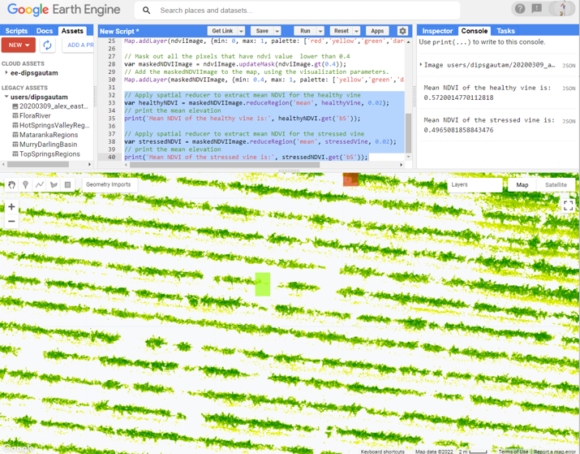

4. The NDVI for healthyVine is 0.57 while for the stressedVine is 0.49. Not much difference. Why do you think that is? Do you think mean NDVI is a good measure? In my example, the stressedVine ,despite being small canopy, had a mean NDVI similar to healthyVine. How about sum of NDVI, do you think that is a better measure. In above script, try changing 'mean' to 'sum' and see what you get. I got 2850 for healthyVine and 532 for stressedVine. 

5. What we have done here in this prac is simple analysis using NDVI to access the canopy condition for grapevine. Note that we only analysed two canopies. However, its not difficult to create a mesh to represent all the canopies and in this similar way get an estimate for all the canopies in a vineyard or any other crops. As a grower, its handy to know how your crops are doing when you have million dollars of fruit hanging on the plant. Any management strategies, fertilizers, irrigation decision could be made early on to reduce the yield and quality loss due to adverse condition.

6. Thats all for today. Dont forget to save your script. 

## 6. The complete script used in this Prac

```
JavaScript
// Import the UAV image into your coding environment.
var UAVImage = ee.Image("users/dipsgautam/20200309_alex_east_ms_orthomosaic_2cm_mga54");

// print the information of the UAVImage
print(UAVImage);

// display the true color composite
Map.addLayer(UAVImage,{bands:['b3','b2','b1'],min:5000,max:40000},"UAV Image True color");

// always centre the map to the UAVImage location
Map.centerObject(UAVImage,19);

//display the false color composite
Map.addLayer(UAVImage,{bands:['b5','b3','b2'],min:5000,max:40000},"UAV Image False color");

//Define variable NDVI from equation
var ndviImage = UAVImage.expression(
  "(NIR - RED) / (NIR + RED)",
  {
    RED: UAVImage.select("b3"),    //  b3 is the RED band
    NIR: UAVImage.select("b5")    // b5 is the NIR band
  });

// Add the NDVI image to the map, using the visualization parameters.
Map.addLayer(ndviImage, {min: 0, max: 1, palette: ['red','yellow','green','darkgreen']}, "NDVI");

// Mask out all the pixels that have ndvi value  lower than 0.4
var maskedNDVIImage = ndviImage.updateMask(ndviImage.gt(0.4));
// Add the maskedNDVIImage to the map, using the visualization parameters.
Map.addLayer(maskedNDVIImage, {min: 0.4, max: 1, palette: ['yellow','green','darkgreen']}, "masked NDVI");

// Apply spatial reducer to extract mean NDVI for the healthy vine
var healthyNDVI = maskedNDVIImage.reduceRegion('sum', healthyVine, 0.02);
// print the mean elevation
print('Mean NDVI of the healthy vine is:', healthyNDVI.get('b5'));

// Apply spatial reducer to extract mean NDVI for the stressed vine
var stressedNDVI = maskedNDVIImage.reduceRegion('sum', stressedVine, 0.02);
// print the mean elevation
print('Mean NDVI of the stressed vine is:', stressedNDVI.get('b5'));
```
-------
### Thank you

I hope you found this prac useful. A recorded video of this prac can be found on your learnline.

#### Kind regards, Deepak Gautam
------
### The end